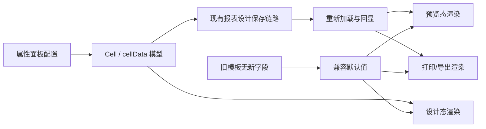
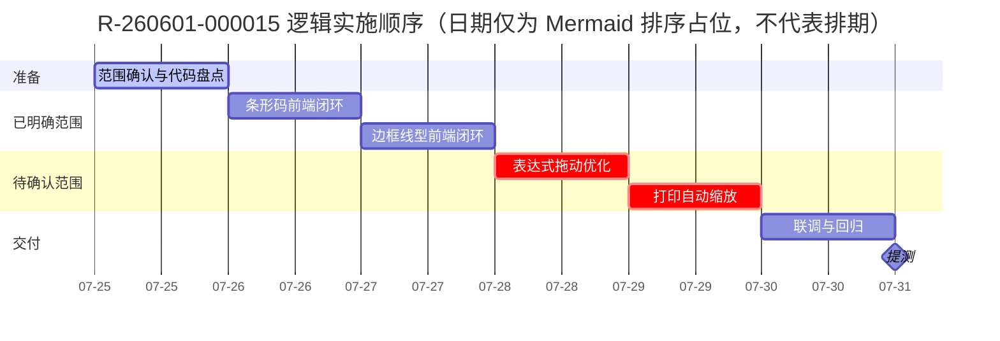

# R-260601-000015 报表优化需求与开发计划

> [!summary] 一句话目标
> 完善报表设计与输出能力：支持条形码展示和多种边框线型，并按产品补充的验收口径完成表达式拖动优化与打印自动缩放。

> [!warning] 文档边界
> 当前后端 DOCX **只明确了“条形码”和“线型”协议**；“表达式拖动优化”和“打印自动缩放”未提供交互、数据结构或验收标准。后两项在澄清前只做计划占位，不直接据此编码。

## 1. 基本信息

| 项目 | 内容 |
|---|---|
| 需求编号 | `R-260601-000015` |
| 需求名称 | 报表优化需求（支持条形码展示、表达式拖动优化、线型、打印自动缩放等） |
| 产品 / 版本 | i8 / 7.0 |
| 阶段 / 优先级 | 二阶段 / P2 |
| 当前状态 | 开发中，整体进度 40%（截至 2026-07-24） |
| 最新记录 | 条形码后端已完成；线型后端已完成 |
| 产品负责人 | 徐远鹏（子仪） |
| 后端负责人 | 孟三涛 |
| 前端负责人 | 刘金旭 |
| 预估工时 | 后端 10h；前端 30h（均来自 Excel） |
| 预计提测 | 2026-07-27（Excel 计划日期，不代表已承诺或已提测） |
| 风险标记 | Excel 标记“无风险”；结合当前范围完整性，本计划建议调整为“范围待确认风险” |
| Wiki | [报表优化需求2604](http://ngwiki.newgrand.com/mediawiki/index.php/%E6%8A%A5%E8%A1%A8%E4%BC%98%E5%8C%96%E9%9C%80%E6%B1%822604) |
| 上级规划 | [[刘金旭-7.0需求项目规划]] |

## 2. 信息来源与可信度

| 来源 | 已确认内容 | 说明 |
|---|---|---|
| `技术中心PaaS平台研发部需求进度跟踪.xlsx` | 负责人、阶段、优先级、状态、40% 进度、工时、预计提测日期、后端完成记录 | 项目跟踪基线，读取日期 2026-07-25 |
| `需求-7.0.docx` | 条形码字段、编码类型、线型字段与 0～13 枚举 | 后端实现说明 |
| 内部 Wiki | 需求合集入口 | 当前为多个报表优化项共用页面，最终验收口径仍需产品确认 |

## 3. 需求范围拆分

| 子需求 | 文档完整度 | 后端状态 | 前端工作 | 当前判断 |
|---|:---:|:---:|---|---|
| 条形码展示 | 高 | 已完成 | 配置 UI、模型读写、设计态/预览态/打印态渲染、校验 | 可立即实施 |
| 边框线型 | 高 | 已完成 | 线型选择、四边属性读写、渲染映射、兼容旧模板 | 可立即实施，但字段类型需确认 |
| 表达式拖动优化 | 低 | 未说明 | 交互与保存行为未知 | 先澄清再开发 |
| 打印自动缩放 | 低 | 未说明 | 触发条件、缩放算法、配置项未知 | 先澄清再开发 |

### 3.1 本次建议纳入

- [ ] 条形码展示：`code_128`、`code_39`、`ean_13`。
- [ ] 边框线型：支持后端定义的 0～13 全部枚举。
- [ ] 保存、重新打开、预览、打印/导出链路保持一致。
- [ ] 老报表模板兼容，不因缺少新增字段而报错或改变原样式。
- [ ] 表达式拖动优化：产品和后端补齐口径后实施。
- [ ] 打印自动缩放：产品和后端补齐口径后实施。

### 3.2 暂不自行推断

- 表达式允许拖动的对象、拖入目标、复制/移动语义及撤销行为。
- 打印自动缩放是“按页宽”“按单页”“按分页区域”还是自定义百分比。
- 条形码不合法数据的后端报错格式和前端提示文案。
- 新字段在历史数据中的默认值。

## 4. 已确认的后端协议

### 4.1 条形码

后端文档规定：在 Cell 的 `cellData` 中，将 `otherShowType` 设置为 `bar_code`，并增加 `encodeType`。

```json
{
  "row": 2,
  "col": 1,
  "cellType": "field",
  "cellData": {
    "dataSetId": "3880000000000001",
    "fieldId": "qty",
    "aggregate": "group",
    "otherShowType": "bar_code",
    "encodeType": "code_128"
  },
  "cellName": "B3"
}
```

#### 字段定义

| 字段 | 位置 | 类型 | 可选值 | 说明 |
|---|---|---|---|---|
| `otherShowType` | `cellData` | string | `bar_code` | 条形码展示；已有 `qr_code` 表示二维码 |
| `encodeType` | `cellData` | string | `code_128`、`code_39`、`ean_13` | 条形码编码方式 |

#### 前端建议行为

1. 单元格展示类型选择“条形码”时显示“编码类型”。
2. 编码类型下拉严格使用后端枚举值，不在前端另造编码。
3. 切换离开“条形码”时：
   - 渲染层忽略 `encodeType`；
   - 是否清除字段由产品确认，建议保留以支持用户切回。
4. 保存后重新打开，展示类型和编码类型必须正确回显。
5. 设计态、预览态、打印/导出态使用一致的数据与编码规则。

#### 编码校验待确认

| 编码 | 至少需要确认 |
|---|---|
| `code_128` | 字符集、最大长度、中文或特殊字符处理方式 |
| `code_39` | 支持字符范围、大小写转换规则、起止符是否自动生成 |
| `ean_13` | 是否只允许 12/13 位数字、校验位由前端还是库自动计算、非法值提示 |

### 4.2 边框线型

后端文档规定：在 `cellBorders` 的具体边（如 `top`）中增加 `borderStyle`。

```json
{
  "cellBorders": {
    "top": {
      "width": 1,
      "color": "#FE0200",
      "borderStyle": "2",
      "hide": false
    }
  }
}
```

> [!warning] 类型待确认
> 示例中的 `borderStyle` 是字符串 `"2"`，枚举说明看起来又是数字 `0～13`。联调前需由后端确认真实 JSON 类型。前端解析可临时兼容 string/number，但保存时必须统一约定。

#### 枚举映射

| 值 | 后端枚举 | 前端显示建议 | 典型样式 |
|:---:|---|---|---|
| 0 | `NONE` | 无边框 | 不显示 |
| 1 | `THIN` | 细实线 | 默认表格线 |
| 2 | `MEDIUM` | 中实线 | 表头分隔 |
| 3 | `DASHED` | 长虚线 | `------` |
| 4 | `DOTTED` | 点线 | `······` |
| 5 | `THICK` | 粗实线 | 标题/合计行 |
| 6 | `DOUBLE` | 双实线 | 双线 |
| 7 | `HAIR` | 发丝线 | 极细线 |
| 8 | `MEDIUM_DASHED` | 中虚线 | 中等宽虚线 |
| 9 | `DASH_DOT` | 点划线 | `-.-.-.-` |
| 10 | `MEDIUM_DASH_DOT` | 中点划线 | 中等宽点划线 |
| 11 | `DASH_DOT_DOT` | 双点划线 | `-..-..-` |
| 12 | `MEDIUM_DASH_DOT_DOT` | 中双点划线 | 中等宽双点划线 |
| 13 | `SLANTED_DASH_DOT` | 斜点划线 | 特殊点划线 |

#### 前端建议行为

1. 上、右、下、左四条边均可独立设置 `borderStyle`。
2. 线型应与现有 `width`、`color`、`hide` 联动，不互相覆盖。
3. 多单元格选择时，支持对选区统一应用线型；混合值按现有属性面板规则展示。
4. 缺少 `borderStyle` 的历史数据继续采用旧版默认实线行为。
5. 值 `0/NONE` 与 `hide=true` 的优先级需确认；建议 `hide=true` 优先。
6. 设计态、预览态、打印/导出态保持视觉一致；浏览器 CSS 不支持的线型需定义降级规则。

## 5. 前端实现方案

### 5.1 数据流



### 5.2 代码改造清单

> [!note]
> 下列模块名是职责描述，不是假定实际目录名。进入代码仓后先按关键词定位真实文件。

#### A. 类型与模型

- [ ] 为 `cellData` 增加可选字段 `encodeType`。
- [ ] 为单元格边框模型的每条边增加可选字段 `borderStyle`。
- [ ] 定义 `BarcodeEncodeType` 和 `BorderStyle` 常量/枚举，避免魔法字符串。
- [ ] 加载时兼容 `borderStyle` 的 string/number；确认协议后统一序列化类型。
- [ ] 新字段保持可选，保证旧 schema 可加载。

#### B. 属性面板

- [ ] “展示类型”增加条形码选项。
- [ ] 仅在条形码模式显示编码类型下拉。
- [ ] 边框面板覆盖 14 个枚举值（13 种可见线型 + `NONE`），并提供可辨识的预览图标。
- [ ] 支持四边单独设置和选区批量设置。
- [ ] 处理混合选区值、禁用状态、重置默认值。

#### C. 渲染

- [ ] 复用或引入已审批的条形码渲染能力。
- [ ] 统一设计态与预览态的条形码参数。
- [ ] 检查打印/导出渲染链路是否能消费条形码结果。
- [ ] 将 0～13 后端枚举映射为设计器可渲染样式。
- [ ] 为 Web/Canvas/SVG/服务端打印间不一致的线型定义降级映射。

#### D. 保存与回显

- [ ] 保存条形码模式及 `encodeType`。
- [ ] 保存每条边的 `borderStyle`。
- [ ] 重开设计器后完整回显。
- [ ] 复制、粘贴、格式刷、撤销/重做不丢新字段。
- [ ] 导入/导出设计 schema 时保留新字段。

#### E. 两项待澄清功能

- [ ] 产品确认表达式拖动优化的用户故事和验收标准。
- [ ] 核对是否存在后端协议或仅为纯前端交互。
- [ ] 产品确认打印自动缩放的触发条件、模式与配置持久化位置。
- [ ] 核对打印服务是否需要适配，避免只在浏览器预览生效。

## 6. 30h 工作量计划

> [!important]
> Excel 的前端 30h 是**总预估**，不是当前剩余工时。40% 是整体需求进度，不能直接折算为前端还剩 18h；实际剩余量需在代码盘点后更新。

| 工作包 | 内容 | 预估 |
|---|---|---:|
| 范围确认与代码盘点 | 核对四项范围、定位模型/面板/渲染/打印链路、确认协议类型 | 3h |
| 条形码 | 配置 UI、模型读写、渲染接入、基础校验 | 6h |
| 边框线型 | 选择 UI、四边模型、渲染映射、旧模板兼容 | 8h |
| 表达式拖动优化 | 按补充后的口径完成交互和回归 | 4h（暂估） |
| 打印自动缩放 | 按补充后的口径完成配置、预览和打印验证 | 4h（暂估） |
| 联调、测试与提测 | 单测、链路回归、缺陷修复、提测说明 | 5h |
| **合计** |  | **30h** |

### 6.1 实施顺序



### 6.2 2026-07-27 提测决策门

2026-07-27 是周一。当前日期为 2026-07-25，且仍有两项范围不明确，因此原提测日期存在现实风险。

| 条件 | 建议 |
|---|---|
| 现有 40% 已覆盖大部分前端代码，且 7月25日完成四项验收口径确认 | 保留 7月27日提测，优先完成端到端回归 |
| 仅条形码和线型范围明确 | 与产品确认“首批只提测条形码+线型”，另外两项拆后续批次 |
| 表达式拖动/自动缩放仍未澄清，但要求四项同批 | 调整提测日期，不以猜测方案换取日期 |
| 打印链路需要后端追加改造 | 由前后端共同重估并更新 Excel 风险状态 |

## 7. 验收标准

### 7.1 条形码（主体可执行，编码校验口径待确认）

- [ ] 用户可将字段单元格展示类型设置为“条形码”。
- [ ] 可选择 `code_128`、`code_39`、`ean_13`，保存 schema 值准确。
- [ ] 保存并重新打开后，展示类型与编码类型正确回显。
- [ ] 设计态、预览态、打印/导出态展示结果一致。
- [ ] 切换普通文本、二维码、条形码时不残留错误渲染状态。
- [ ] 空值、超长值和非法值有明确且不阻断页面的处理方式。
- [ ] 历史报表不包含 `encodeType` 时可正常打开。

### 7.2 边框线型（可执行）

- [ ] 0～13 所有线型均可选择、保存和回显。
- [ ] 上、右、下、左四边可独立配置。
- [ ] 线型与颜色、宽度、显示/隐藏组合生效。
- [ ] 单个单元格和多单元格选区均可配置。
- [ ] 复制粘贴、格式刷、撤销重做不丢失线型。
- [ ] 设计态、预览态、打印/导出态视觉结果一致；不能一致的样式有确定的降级规则。
- [ ] 旧模板缺少 `borderStyle` 时保持历史显示效果。

### 7.3 表达式拖动优化（待产品补齐）

- [ ] 明确可拖动对象和拖放目标。
- [ ] 明确拖动是移动、复制还是生成引用。
- [ ] 明确跨行、跨列、跨 Sheet 和合并单元格行为。
- [ ] 明确拖动后的公式引用变化规则。
- [ ] 明确撤销/重做及非法目标提示。

### 7.4 打印自动缩放（待产品补齐）

- [ ] 明确缩放模式：按页宽、单页、分页区域或百分比。
- [ ] 明确纸张、方向、页边距、分页符对缩放的影响。
- [ ] 明确最小字号/最小缩放比例和超限行为。
- [ ] 明确配置是否需要持久化以及保存位置。
- [ ] 明确预览、PDF、真实打印结果的一致性标准。

## 8. 测试矩阵

| 维度 | 用例 |
|---|---|
| 条形码类型 | code_128 / code_39 / ean_13 |
| 条形码数据 | 正常值、空值、非法字符、超长值、EAN-13 位数与校验位 |
| 单元格来源 | 文本、数据集字段、动态展开字段 |
| 线型 | 0～13 全枚举 |
| 边框位置 | 单边、四边、不同边不同线型 |
| 属性组合 | 线型 × 宽度 × 颜色 × hide |
| 编辑操作 | 保存/重开、复制粘贴、格式刷、撤销重做、多选批量 |
| 渲染链路 | 设计态、预览态、打印、PDF/导出（按系统实际能力） |
| 兼容性 | 老模板、新模板、缺字段、string/number 两种 borderStyle 输入 |
| 复杂布局 | 合并单元格、冻结行列、分页、动态扩展、多个 Sheet |

## 9. 联调问题清单

### 产品（徐远鹏）

- [ ] 表达式“拖动优化”的完整操作流程和验收样例是什么？
- [ ] 打印自动缩放的模式、入口、默认值和持久化规则是什么？
- [ ] 四个子项必须同批提测吗？能否先提条形码和线型？
- [ ] EAN-13 输入校验和错误提示的产品口径是什么？此项未关闭前，非法值相关验收用例视为阻塞。
- [ ] 14 个枚举值（13 种可见线型 + `NONE`）是否全部在 UI 展示，还是只展示常用项？

### 后端（孟三涛）

- [ ] `borderStyle` 最终类型是 string 还是 number？保存和返回是否一致？
- [ ] 历史数据缺失 `encodeType` / `borderStyle` 时后端默认行为是什么？
- [ ] 条形码非法值是否由后端校验？错误码和消息是什么？
- [ ] 条形码、线型是否已覆盖预览及打印/导出链路，还是仅完成 schema 存储？
- [ ] `NONE(0)` 与 `hide=true` 的优先级如何定义？
- [ ] 表达式拖动和自动缩放是否还有未写入 DOCX 的协议？

## 10. 风险与应对

| 风险 | 影响 | 应对 |
|---|---|---|
| DOCX 只覆盖 2/4 子项 | 无法完整实现和验收 | 先设需求澄清门，未确认不编码 |
| 后端“已完成”可能仅指模型/存储 | 预览或打印链路联调失败 | 首日完成端到端接口和输出验证 |
| `borderStyle` 类型不一致 | 回显失败、脏数据 | 读兼容两种类型，写入遵循最终协议 |
| 条形码库规则不一致 | 设计态与打印结果不同 | 统一编码规则，并用同一组样例联调 |
| 复杂线型跨渲染器不一致 | 打印样式失真 | 建立枚举降级表并由产品签字确认 |
| 7月27日日期过紧 | 压缩测试导致回归缺陷 | 拆批提测或调整日期，不能跳过兼容测试 |

## 11. 提测清单 / Definition of Done

- [ ] 四项范围和拆批策略已确认并留痕。
- [ ] 条形码、线型协议字段和类型已与后端确认。
- [ ] 代码评审完成，无调试代码和新增控制台错误。
- [ ] 单元测试/组件测试通过。
- [ ] 条形码三种编码和 14 个边框枚举值（13 种可见线型 + `NONE`）核心用例通过。
- [ ] 老模板兼容验证通过。
- [ ] 设计态、预览态、打印/导出链路验证通过。
- [ ] 已知限制和线型降级规则写入提测说明。
- [ ] 提测包、环境、版本号及测试数据准备完成。
- [ ] Excel 进度、风险和实际提测日期同步更新。

## 12. 开发日志

### 2026-07-25

- 根据 Excel 和 `需求-7.0.docx` 建立独立需求与开发计划。
- 已确认后端文档覆盖条形码和线型。
- 发现表达式拖动优化、打印自动缩放缺少实现与验收说明。
- 下一步：完成代码盘点，并与产品、后端关闭第 9 节问题。
