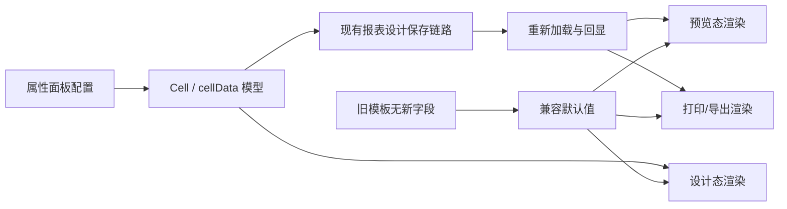
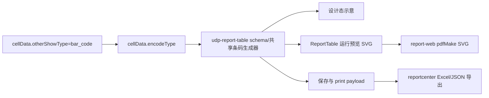
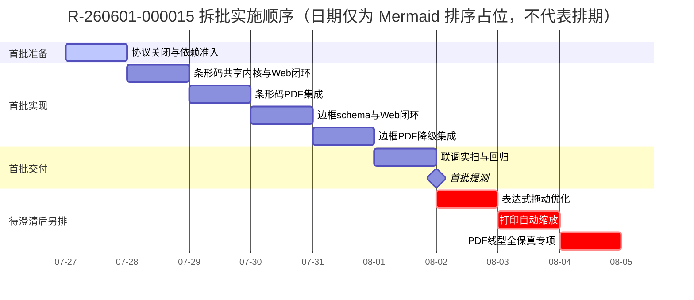

# R-260601-000015 报表优化需求与开发计划

> [!summary] 一句话目标
> 完善报表设计与输出能力：支持条形码展示和多种边框线型，并按产品补充的验收口径完成表达式拖动优化与打印自动缩放。

> [!warning] 文档边界
> 当前后端 DOCX **只明确了“条形码”和“线型”协议**；“表达式拖动优化”和“打印自动缩放”未提供交互、数据结构或验收标准。后两项在澄清前只做计划占位，不直接据此编码。

## 1. 基本信息

| 项目 | 内容 |
|---|---|
| 需求编号 | `R-260601-000015` |
| 需求名称 | 报表优化需求（支持条形码展示、表达式拖动优化、线型、打印自动缩放等） |
| 产品 / 版本 | i8 / 7.0 |
| 阶段 / 优先级 | 二阶段 / P2 |
| 当前状态 | 开发中，整体进度 40%（截至 2026-07-24） |
| 最新记录 | 条形码后端已完成；线型后端已完成 |
| 产品负责人 | 徐远鹏（子仪） |
| 后端负责人 | 孟三涛 |
| 前端负责人 | 刘金旭 |
| 预估工时 | 后端 10h；前端 30h（均来自 Excel） |
| 预计提测 | 2026-07-27（Excel 计划日期，不代表已承诺或已提测） |
| 风险标记 | Excel 标记“无风险”；结合当前范围完整性，本计划建议调整为“范围待确认风险” |
| Wiki | [报表优化需求2604](http://ngwiki.newgrand.com/mediawiki/index.php/%E6%8A%A5%E8%A1%A8%E4%BC%98%E5%8C%96%E9%9C%80%E6%B1%822604) |
| 上级规划 | [[刘金旭-7.0需求项目规划]] |

## 2. 信息来源与可信度

| 来源 | 已确认内容 | 说明 |
|---|---|---|
| `技术中心PaaS平台研发部需求进度跟踪.xlsx` | 负责人、阶段、优先级、状态、40% 进度、工时、预计提测日期、后端完成记录 | 项目跟踪基线，读取日期 2026-07-25 |
| `需求-7.0.docx` | 条形码字段、编码类型、线型字段与 0～13 枚举 | 后端实现说明 |
| 内部 Wiki | 需求合集入口 | 当前为多个报表优化项共用页面，最终验收口径仍需产品确认 |
| `~/win/workspace/xzd/ng-design` / `ljx-7.0` | 报表组件库源码与设计/预览能力 | 已于 2026-07-25 只读盘点；核心包为 `@newgrand/udp-report-table` |
| `~/win/workspace/xzd/report-web` / `ljx-7.0` | 报表页面接入与 pdfMake 打印/PDF 导出 | 已于 2026-07-25 只读盘点；依赖 `@newgrand/udp-report-table ~7.0.6` |

## 3. 需求范围拆分

| 子需求 | 文档完整度 | 后端状态 | 前端工作 | 当前判断 |
|---|:---:|:---:|---|---|
| 条形码展示 | 高 | 已完成 | 配置 UI、模型读写、设计态/预览态/打印态渲染、校验 | 可立即实施 |
| 边框线型 | 高 | 已完成 | 线型选择、四边属性读写、渲染映射、兼容旧模板 | 可立即实施，但字段类型需确认 |
| 表达式拖动优化 | 低 | 未说明 | 交互与保存行为未知 | 先澄清再开发 |
| 打印自动缩放 | 低 | 未说明 | 触发条件、缩放算法、配置项未知 | 先澄清再开发 |

### 3.1 本次建议纳入

- [ ] 条形码展示：`code_128`、`code_39`、`ean_13`，能力归属 `@newgrand/udp-report-table`，不在 `@newgrand/udp-ui` 新增脱离报表 schema 的通用业务组件。
- [ ] 边框线型：schema、配置、保存和回显支持后端定义的 0～13 全部枚举；Web/PDF 的视觉保真度按已确认的映射与降级表验收。
- [ ] 保存、重新打开、预览、打印/导出链路使用同一组枚举、校验和条码编码逻辑。
- [ ] 老报表模板兼容，不因缺少新增字段而报错或改变原样式。
- [ ] 表达式拖动优化：产品和后端补齐口径后实施。
- [ ] 打印自动缩放：产品和后端补齐口径后实施。

### 3.2 暂不自行推断

- 表达式允许拖动的对象、拖入目标、复制/移动语义及撤销行为。
- 打印自动缩放是“按页宽”“按单页”“按分页区域”还是自定义百分比。
- 条形码不合法数据的后端报错格式和前端提示文案。
- 新字段在历史数据中的默认值。

## 4. 已确认的后端协议

### 4.1 条形码

后端文档规定：在 Cell 的 `cellData` 中，将 `otherShowType` 设置为 `bar_code`，并增加 `encodeType`。

```json
{
  "row": 2,
  "col": 1,
  "cellType": "field",
  "cellData": {
    "dataSetId": "3880000000000001",
    "fieldId": "qty",
    "aggregate": "group",
    "otherShowType": "bar_code",
    "encodeType": "code_128"
  },
  "cellName": "B3"
}
```

#### 字段定义

| 字段 | 位置 | 类型 | 可选值 | 说明 |
|---|---|---|---|---|
| `otherShowType` | `cellData` | string | `bar_code` | 条形码展示；已有 `qr_code` 表示二维码 |
| `encodeType` | `cellData` | string | `code_128`、`code_39`、`ean_13` | 条形码编码方式 |

#### 前端建议行为

1. 单元格展示类型选择“条形码”时显示“编码类型”。
2. 编码类型下拉严格使用后端枚举值，不在前端另造编码。
3. 切换离开“条形码”时：
   - 渲染层忽略 `encodeType`；
   - 是否清除字段由产品确认，建议保留以支持用户切回。
4. 保存后重新打开，展示类型和编码类型必须正确回显。
5. 设计态、预览态、打印/导出态使用一致的数据与编码规则。

#### 编码校验待确认

| 编码 | 至少需要确认 |
|---|---|
| `code_128` | 字符集、最大长度、中文或特殊字符处理方式 |
| `code_39` | 支持字符范围、大小写转换规则、起止符是否自动生成 |
| `ean_13` | 是否只允许 12/13 位数字、校验位由前端还是库自动计算、非法值提示 |

### 4.2 边框线型

后端文档规定：在 `cellBorders` 的具体边（如 `top`）中增加 `borderStyle`。

```json
{
  "cellBorders": {
    "top": {
      "width": 1,
      "color": "#FE0200",
      "borderStyle": "2",
      "hide": false
    }
  }
}
```

> [!warning] 类型待确认
> 示例中的 `borderStyle` 是字符串 `"2"`，枚举说明看起来又是数字 `0～13`。联调前需由后端确认真实 JSON 类型。前端解析可临时兼容 string/number，但保存时必须统一约定。

#### 枚举映射

| 值 | 后端枚举 | 前端显示建议 | 典型样式 |
|:---:|---|---|---|
| 0 | `NONE` | 无边框 | 不显示 |
| 1 | `THIN` | 细实线 | 默认表格线 |
| 2 | `MEDIUM` | 中实线 | 表头分隔 |
| 3 | `DASHED` | 长虚线 | `------` |
| 4 | `DOTTED` | 点线 | `······` |
| 5 | `THICK` | 粗实线 | 标题/合计行 |
| 6 | `DOUBLE` | 双实线 | 双线 |
| 7 | `HAIR` | 发丝线 | 极细线 |
| 8 | `MEDIUM_DASHED` | 中虚线 | 中等宽虚线 |
| 9 | `DASH_DOT` | 点划线 | `-.-.-.-` |
| 10 | `MEDIUM_DASH_DOT` | 中点划线 | 中等宽点划线 |
| 11 | `DASH_DOT_DOT` | 双点划线 | `-..-..-` |
| 12 | `MEDIUM_DASH_DOT_DOT` | 中双点划线 | 中等宽双点划线 |
| 13 | `SLANTED_DASH_DOT` | 斜点划线 | 特殊点划线 |

#### 前端建议行为

1. 上、右、下、左四条边均可独立设置 `borderStyle`。
2. 线型应与现有 `width`、`color`、`hide` 联动，不互相覆盖。
3. 多单元格选择时，支持对选区统一应用线型；混合值按现有属性面板规则展示。
4. 缺少 `borderStyle` 的历史数据继续采用旧版默认实线行为。
5. 值 `0/NONE` 与 `hide=true` 的优先级需确认；建议 `hide=true` 优先。
6. 设计态、预览态、打印/导出态保持视觉一致；浏览器 CSS 不支持的线型需定义降级规则。

## 5. 前端实现方案

### 5.1 数据流



### 5.2 代码改造清单

> [!note]
> 下列模块名是职责描述，不是假定实际目录名。进入代码仓后先按关键词定位真实文件。

#### A. 类型与模型

- [ ] 为 `cellData` 增加可选字段 `encodeType`。
- [ ] 为单元格边框模型的每条边增加可选字段 `borderStyle`。
- [ ] 定义 `BarcodeEncodeType` 和 `BorderStyle` 常量/枚举，避免魔法字符串。
- [ ] 加载时兼容 `borderStyle` 的 string/number；确认协议后统一序列化类型。
- [ ] 新字段保持可选，保证旧 schema 可加载。

#### B. 属性面板

- [ ] “展示类型”增加条形码选项。
- [ ] 仅在条形码模式显示编码类型下拉。
- [ ] 边框面板覆盖 14 个枚举值（13 种可见线型 + `NONE`），并提供可辨识的预览图标。
- [ ] 支持四边单独设置和选区批量设置。
- [ ] 处理混合选区值、禁用状态、重置默认值。

#### C. 渲染

- [ ] 复用或引入已审批的条形码渲染能力。
- [ ] 统一设计态与预览态的条形码参数。
- [ ] 检查打印/导出渲染链路是否能消费条形码结果。
- [ ] 将 0～13 后端枚举映射为设计器可渲染样式。
- [ ] 为 Web/Canvas/SVG/服务端打印间不一致的线型定义降级映射。

#### D. 保存与回显

- [ ] 保存条形码模式及 `encodeType`。
- [ ] 保存每条边的 `borderStyle`。
- [ ] 重开设计器后完整回显。
- [ ] 复制、粘贴、格式刷、撤销/重做不丢新字段。
- [ ] 导入/导出设计 schema 时保留新字段。

#### E. 两项待澄清功能

- [ ] 产品确认表达式拖动优化的用户故事和验收标准。
- [ ] 核对是否存在后端协议或仅为纯前端交互。
- [ ] 产品确认打印自动缩放的触发条件、模式与配置持久化位置。
- [ ] 核对打印服务是否需要适配，避免只在浏览器预览生效。

### 5.3 代码仓库核验结果与文件级实施计划

> [!important] 代码盘点状态（2026-07-27 复核）
> 本节已基于两个 `ljx-7.0` 分支的源码完成路径核验。以下是**计划中的改动点**，不是已经执行的业务代码修改。
>
> 2026-07-25 盘点时两个工作区曾存在大量未提交改动；2026-07-27 再次执行 `git status --porcelain` 时，`ng-design` 与 `report-web` 均无输出，即当前工作树干净。后续仍禁止为本需求执行无关的 checkout/reset/全仓格式化，并应在每个仓库分别提交。

### 5.3.1 实际职责边界

| 仓库 / 服务 | 分支 | 本需求职责 | 已核验入口 |
|---|---|---|---|
| `~/win/workspace/xzd/ng-design` | `ljx-7.0` | 报表组件库：设计器、字段属性、Handsontable 设计态、组件内运行预览、schema 保存/加载/输出；提供无 pdfMake 依赖的共享条码 SVG 生成器 | `packages/@newgrand/udp-report-table/src/` |
| `~/win/workspace/xzd/report-web` | `ljx-7.0` | 业务页面接入、打印模板预览页、浏览器端 pdfMake 打印/PDF 导出 | `src/pages/TableManager/`、`src/pages/PrintManager/preview/`、`src/components/report/print/` |
| `/reportcenter/reportExport/printDesignExport` | 后端服务 | 打印模板的 Excel/JSON 导出；消费组件包序列化的 schema，但不等于浏览器 PDF 链路 | `udp-report-table/src/design/service.ts`、`report-web/src/pages/PrintManager/preview/export.ts` |

当前打印相关动作必须按三条链路分别验收：

1. **设计态打印预览**：`TopHeaderTitle` 调用 `handleSavedSheetsSchema` 和 `buildPrintDesignPayload`，再经 observer 发布 `previewPrintSchema-*`；`report-web /tableDesign/PrintManager/preview` 接收并请求运行数据。
2. **浏览器打印/PDF**：`report-web/src/pages/PrintManager/preview/index.tsx` 从 `ReportTableAPI` 取得 Handsontable 实例，调用 `handleRenderPDF` / `handleExportPDF`，最终由 `src/components/report/print/utils/PDF.ts` 组装 pdfMake 内容。
3. **打印模板 Excel/JSON 导出**：调用 `/reportcenter/reportExport/printDesignExport` 返回 Blob；必须验证新增 schema 字段被服务端保留/识别，但不能用此接口的成功代替 PDF 条码验收。

`report-web/src/pages/TableManager/design/index.tsx` 只挂载 `DesignReportTable`，具体设计器不应在业务仓复制实现。组件包的边界测试已明确要求 `pdfmake/html2canvas/idb/dayjs` 等运行时打印依赖留在 `report-web`；本需求不得恢复历史上已删除的 `udp-report-table/src/print/*`，共享的只能是条码枚举、校验和 SVG 生成器。

### 5.3.2 现有能力与缺口

| 子项 | 已有实现 | 确认缺口 / 结论 |
|---|---|---|
| 条形码 | 字段属性已有 `otherShowType`，只提供 `image`、`qr_code` 选项 | `bar_code`、`encodeType`、设计/预览渲染、PDF 输出均未找到；组件包未声明条码依赖 |
| 二维码 | 仅发现 `qr_code` 枚举 | 未找到可复用二维码渲染链路；不能假设可直接复用 |
| 边框 | 已有全/外/四边/清除工具、`width/color/hide`、schema 保存、设计和预览恢复 | 未找到 `borderStyle`；设计态硬编码 `solid` 且对缺失的单边对象直接解引用；预览动态类名未含线型；PDF 仅处理显示与颜色；清除右侧邻边使用 `start`、外框函数残留调试日志，实施时需一并用回归测试修正 |
| 表达式拖动 | `CustomPlugin.beforeAutofill` 调用 `handlePasteCells(..., 'fill')`，按源范围循环复制完整单元格 metadata | 现有实现并未对表达式引用做相对/绝对地址转换；“优化”到底是修复引用、交互还是性能，必须先确认 |
| 打印缩放 | 打印设置已有手工 `page.scaleRatio`（50%～200%），`report-web` 用其计算 `transScale` | 没有自动适配模式；不能修改既有 `scaleRatio` 的语义，需要新增显式模式 |

### 5.3.3 条形码：文件级实施计划

#### A. `ng-design`：配置、schema 和设计态

| 文件 | 计划改动 | 验证点 |
|---|---|---|
| `packages/@newgrand/udp-report-table/src/design/TableDesign/consts.tsx` | 在 `defaultFieldCell.cellData` 中增加可选 `encodeType` 默认值策略；保持旧 schema 缺字段可加载 | 新建字段单元格、老模板加载均正常 |
| `.../rightCellProperties/cellProperiesForms/fieldForms.ts` | 在“其他展示形式”中增加 `bar_code`；仅 `bar_code` 时显示 `encodeType` 下拉，值严格为 `code_128` / `code_39` / `ean_13` | 属性面板条件显示、保存和回显 |
| `.../rightCellProperties/utils/field.ts` | 定义切换 `otherShowType` 时 `format`、`formatValue`、`encodeType` 的保留/清除规则；不得破坏图片模式现有默认值 | 文本、图片、二维码、条形码来回切换 |
| `.../customTable/plugins/fieldRender/index.ts`（必要时新增相邻条码渲染模块） | 基于 `cellData.otherShowType === 'bar_code'` 从现有字段/文本 renderer 分流；不新增独立 cell type，也不复用图片 cell type，以免改变既有字段保存和复制语义；设计态展示受控示意 | 拖入字段、切换展示形式、选区刷新、合并单元格 |
| `.../customTable/utils/cellData.ts` | 确保属性变化会触发重新渲染，并且设计态字段名占位与条码展示互不污染 | 修改编码类型后即时刷新 |
| `.../TableDesign/utils/load.ts`、`.../utils/save.ts`、`.../utils/saveUtil.ts` | 只做兼容性核验/必要的默认化：`cellData` 是保存字段，不能在加载时无故丢弃 `encodeType` | 设计保存 → 重开 → schema 对比 |

#### B. `ng-design`：运行预览

| 文件 | 计划改动 | 验证点 |
|---|---|---|
| `packages/@newgrand/udp-report-table/src/preview/plugins/textRender.tsx` | 当前字段结果走文本渲染路径；增加条形码分支或抽取共享渲染器，使用 `formatData` / 字段运行值而非设计态字段名 | 接口返回正常值、空值、合并单元格 |
| `.../preview/tableSheets/index.tsx` | 若新增专用 renderer/cell type，在此注册；否则明确维持 text renderer 分支，避免重复注册或类型覆盖 | 多 Sheet 切换后仍正确渲染 |
| `.../preview/plugins/utils.ts` | 复用清理 React root/TD 的机制，避免从条码切回文本时残留 SVG/Canvas | 虚拟滚动、反复刷新、切换 Sheet |

#### C. 条码生成方案决策（2026-07-27 优化结论）

`@newgrand/udp-report-table` 当前没有条码依赖。对候选库复核后，首选 **`JsBarcode`**，而不是把条码能力放进 `@newgrand/udp-ui`，也不优先引入 `bwip-js`：

| 方案 | 结论 | 原因 |
|---|---|---|
| `JsBarcode` | **首选，准入通过后实施** | MIT；覆盖本需求全部三个码制；可直接写入 SVG；包体明显小于支持 100+ 码制的 `bwip-js` |
| `bwip-js` | 备选 | MIT、码制丰富、可输出 SVG，但当前需求只用三个码制，引入成本和包体偏大 |
| 后端图片/服务 | 暂不选 | 当前协议只返回 `otherShowType/encodeType`，没有图片 URL/Data URL 字段，会增加接口、缓存和打印失败点 |
| DOM 截图/Canvas 截图 | 禁止作为主方案 | 虚拟滚动、分页、缩放和设备像素比会导致清晰度与可扫描性不稳定 |

优化后的模块设计：

```text
udp-report-table/src/barcode/
├── constants.ts       # 后端枚举与 JsBarcode format 的唯一映射
├── types.ts           # BarcodeEncodeType / BarcodeRenderResult / 错误码
├── generateSvg.ts     # 同步生成 SVG，统一校验与异常收口
└── renderCell.ts      # Handsontable 单元格挂载、尺寸适配与清理
```

包根导出不暴露第三方类型，只暴露稳定的项目 API：

```ts
export type BarcodeEncodeType = 'code_128' | 'code_39' | 'ean_13';

export type BarcodeRenderResult =
  | { ok: true; svg: string }
  | { ok: false; reason: 'EMPTY' | 'INVALID_VALUE' | 'UNSUPPORTED_FORMAT'; message: string };

export function generateBarcodeSvg(options: {
  value: unknown;
  encodeType?: BarcodeEncodeType;
  width?: number;
  height?: number;
  displayValue?: boolean;
}): BarcodeRenderResult;
```

唯一映射固定为：`code_128 → CODE128`、`code_39 → CODE39`、`ean_13 → EAN13`。`generateBarcodeSvg` 必须同步、无 DOM 查询、无网络请求；第三方异常统一转成结果对象，禁止让一个非法单元格中断整张报表渲染。

依赖放置规则：

- `jsbarcode` 放入 `packages/@newgrand/udp-report-table/package.json` 的 `dependencies`，不能只放根目录 `devDependencies`；
- 类型包放在开发依赖，生成的 `.d.ts` 不泄漏 `JsBarcode` 类型；
- 更新根 `package-lock.json`，并经过公司依赖准入/许可证扫描；
- `report-web` 只能调用 `@newgrand/udp-report-table` 导出的生成器，禁止直接再次依赖 `jsbarcode`。

渲染策略：

1. **设计态**：字段尚无运行值，不生成伪造的业务条码；展示可辨识的条码示意、编码类型和字段名。切换编码类型即时刷新。
2. **运行预览**：使用 `formatData` 作为唯一业务值，SVG 按单元格可用宽高等比缩放并居中；从条码切回文本时彻底清理旧 SVG/root。
3. **打印/PDF**：在 `report-web` 的 `PDF.ts` 中同步调用同一生成器，写入 pdfMake 的 `cell.svg`，按单元格可用宽高设置 `fit`；不进入 `imagePromise`，不截图，不重复编码规则。
4. **空值**：渲染为空单元格，不报错。
5. **非法值**：Web 降级显示原始文本和非阻断提示；PDF 降级打印原始文本，禁止输出空白码或自动篡改数据。
6. **默认编码**：用户首次切换到条形码时写入 `code_128`；加载到 `bar_code` 但缺少 `encodeType` 的异常/过渡数据时仅按 `code_128` 兼容渲染，用户保存后再落明确值。
7. **切换策略**：切换离开 `bar_code` 时保留 `encodeType`，渲染层忽略它，便于切回；这不影响旧模板。

仍需产品关闭的视觉口径只有：是否显示人眼可读文本、最小条码尺寸、超小单元格提示方式。编码值和三种码制不再另造前端协议。

#### D. `report-web`：打印/PDF

| 文件 | 计划改动 | 验证点 |
|---|---|---|
| `src/components/report/print/utils/PDF.ts` | 识别 `cellData.otherShowType === 'bar_code'`，同步调用组件包导出的 `generateBarcodeSvg`，写入 pdfMake `cell.svg` 与 `fit`；按可用宽高缩放并扣除边框、内边距 | 打印、PDF 下载、普通文本/图片/图表回归 |
| `src/components/report/print/pdfmake.d.ts` | 补齐项目实际使用的 SVG 节点类型，不使用 `any` 掩盖集成错误 | TypeScript 构建通过，声明与 pdfMake 0.3 运行行为一致 |
| `src/components/report/print/utils/index.ts` | 不增加条码异步队列；只验证分页、横向切片和生成失败时的文本回退 | 多页、跨列切片、长内容 |
| `src/pages/TableManager/preview/index.tsx` | 原则上不新增业务逻辑；仅对 `ReportTable` 运行结果和 `handleRenderPDF` / `handleExportPDF` 端到端验证 | 预览与导出同值同码制 |

### 5.3.4 边框线型：文件级实施计划

| 文件 | 计划改动 | 必须注意 |
|---|---|---|
| `ng-design/.../cusToolbar/components/cellBorderBtn/index.tsx` | 在现有边框 Popover 中增加线型选择（14 个枚举值：13 种可见线型 + `NONE`）和当前线型反馈 | 保留现有“边框范围 + 颜色”操作，不改变用户已有快捷操作 |
| `ng-design/.../customTable/utils/borders.ts` | 将 `defaultBorder` 扩展为含 `borderStyle`；所有 `setBorders`、清除、外框、单边、插删行列迁移均保留该字段；移除外框调试日志，并验证/修复清除右侧邻边时 `start/end` 方向 | Handsontable 使用 `start/end`，后端 schema 用 `left/right` 时要继续兼容转换；不得顺手改变未覆盖测试的相邻边语义 |
| `ng-design/.../customTable/plugins/utils/style.ts` | 将硬编码 `${width}px solid ${color}` 改为统一的 `borderStyle → CSS border-style` 映射；先安全判断每一边是否存在，再应用 `NONE`/`hide` 优先级 | 单边 metadata 不抛错；设计态、合并单元格、冻结边界、邻格补边 |
| `ng-design/.../customTable/plugins/textRender/render.ts` | 修复目前只移除 `htBorder_Right_1_000000` / `htBorder_Bottom_1_000000` 的固定类名假设，使合并格适配任意颜色、宽度和线型 | 合并单元格 + 非默认线型 |
| `ng-design/.../preview/plugins/utils.ts` | 扩展 `getBorderClassName` / `normalizeCellBorders`，让类名包含线型并兼容后端传来的 string/number | 旧 schema 不含 `borderStyle` 时默认实线 |
| `ng-design/.../preview/tableSheets/utils.ts` | 预加载动态边框类时使用包含线型的新类名，保证刷新/切 Sheet 仍注入正确样式 | 多 Sheet、动态行列 |
| `report-web/src/components/report/print/utils/PDF.ts` | pdfMake 当前仅设置 `cell.border` / `borderColor`，且表级 `hLineWidth/vLineWidth` 是统一宽度；需先确认 pdfMake 能否对每条单元格边表达 14 种线型。若不能，采用已确认的降级策略或图像/SVG 绘制，不可声称全量保真 | 不能仅改 Web CSS 就宣布打印支持 |

> [!warning] 线型协议门
> 后端 DOCX 示例是 `"borderStyle": "2"`，枚举表又是数值 0～13。前端加载可暂时兼容 `string | number`，但**保存类型、`NONE(0)` 与 `hide=true` 的优先级、以及 pdfMake 的可表达范围**必须由后端和产品确认后才可冻结方案。

### 5.3.5 表达式拖动优化：只做问题确认，不与已明确功能捆绑

已找到的现有代码是：

- `ng-design/.../customTable/plugins/customPlugin.ts`：`beforeAutofill` 拦截 Handsontable 自动填充；
- `ng-design/.../customTable/utils/copy.ts`：`handlePasteCells(..., 'fill')` 周期性复制整份 cell metadata；
- `ng-design/.../customTable/plugins/expressRender/index.ts`：表达式目前只是交给 `HotTextRender` 展示。

因此，若产品所说的“表达式拖动优化”是**填充后相对引用自动位移**，需要设计单独的表达式解析/引用转换规则，不能直接复用当前整对象复制；若只是字段拖入/交互优化，则改动点会完全不同。实施前必须给出至少一个“当前错误行为 → 期望行为”的样例（含横/纵填充、绝对/相对引用、合并格和撤销重做）。

### 5.3.6 打印自动缩放：真实实现边界

现有实现已提供手工缩放：

- 配置 UI：`ng-design/.../printSetting/tabChildren/page.tsx` 的 `page.scaleRatio`（50%～200%）；
- 配置默认与保存：`ng-design/.../printSetting/index.tsx`、`design/printPayload.ts`；
- PDF 换算：`report-web/src/components/report/print/utils/setting.ts` 以 `scaleRatio / 100` 得到 `transScale`；
- 分页和 PDF 表格：`report-web/src/components/report/print/utils/index.ts`、`PDF.ts`。

自动适配应设计为新增的显式字段（例如 `fitMode`），**不能重定义或静默覆盖**历史 `scaleRatio`。建议的实施顺序：

1. 产品确定模式：按页宽、单页、按页高、缩小适配或允许放大；
2. `ng-design` 在打印设置 UI、`initPrintSetting`、保存/加载中透传该模式；
3. `report-web` 在 `handlePrintSetting` 中对纸张方向、自定义纸张、页边距、页眉页脚、内容区尺寸、表格边线计算有效缩放；
4. 计算必须进入现有 `transScale` 统一链路，覆盖列切片、分页、合并格、`dontBreakRows`、浮动图片；
5. 历史模板缺少模式时继续严格使用手工 `scaleRatio`，保证 PDF 输出不变。

### 5.4 2026-07-27 方案复核后的实施收敛

#### 5.4.1 修正原方案的职责边界

此前“在 `udp-ui` 增加 `Barcode` 并支持 `$NG.createElement('Barcode')`”不符合本 PRD，予以取消。本需求的条码不是孤立公共组件，而是报表 schema 驱动的单元格展示能力：



职责约束：

- `udp-ui`：不新增条码业务组件、不注册 `$NG.createElement('Barcode')`；
- `udp-report-table`：拥有枚举、配置、校验、SVG 生成、设计/预览渲染、schema/payload 透传和公共生成器导出；不拥有 pdfMake 运行时；
- `report-web`：负责打印模板运行页、分页与 pdfMake 组装，复用组件包生成器，不复制码制映射；
- 后端：继续提供原始字段值、`otherShowType` 和 `encodeType`，并确认 Excel/JSON 导出对新 schema 字段的处理；无需新增条码图片接口。

#### 5.4.2 条形码实施步骤与提交边界

| 步骤 | 仓库 / 文件 | 改动 | 独立验证 |
|---|---|---|---|
| 1. 协议与生成器 | `ng-design`：新增 `src/barcode/*`、包根出口、依赖 | 枚举映射、同步 SVG、空值/非法值结果、类型不泄漏第三方 | Node/DOM 单测覆盖三种码制和非法值 |
| 2. 配置与模型 | `consts.tsx`、`fieldForms.ts`、`utils/field.ts`、类型 | 增加 `bar_code`、条件显示 `encodeType`、首次默认 `code_128`、切走保留 | 选择、保存、重开、旧 schema |
| 3. 设计态 | `fieldRender` 相邻专用 renderer | 只展示设计示意，不用伪造业务值冒充真实结果 | 拖入、切换、合并、冻结 |
| 4. 运行预览 | `preview/plugins/textRender.tsx` 及清理工具 | 在链接/过滤文本分支前识别条码；使用 `formatData`；清理残留 | 空值、非法值、虚拟滚动、多 Sheet |
| 5. PDF | `report-web/PDF.ts`、`pdfmake.d.ts` | `cell.svg + fit`；异常退回原始文本；不使用异步图片队列 | 打印预览、下载、多页、横向切片、合并格 |
| 6. Schema 输出回归 | `saveUtil.ts`、`design/utils/index.ts`、`printPayload.ts`、服务端导出接口 | 确保 `encodeType` 和四边 `borderStyle` 不被 cell 筛选、归一化或 payload 构造丢弃 | 保存→重开；observer 预览 payload；Excel/JSON 导出 schema |
| 7. 集成回归 | 两仓 | 固定 schema 样例贯通保存→查询→ReportTable 预览→report-web PDF | 相同值/码制产生同一编码结果 |

提交建议按上述 1～6 拆分，先发 `udp-report-table` 新版本，再升级 `report-web` 依赖；禁止在 `report-web` 通过相对路径引用 `ng-design` 源码。服务端 Excel/JSON 导出兼容可与 Web 实现并行联调，但 PDF 完成状态必须以 `report-web` 和真实扫描结果为准。

#### 5.4.3 条码校验与可扫描性门禁

自动化测试不能替代真实扫描，验收分三层：

1. **编码单测**：SVG 非空、包含预期图形节点、非法值返回受控错误、输入不被隐式修改；
2. **链路测试**：同一 schema 在预览/PDF 都走共享生成器，空值/非法值不导致页面或整份 PDF 失败；
3. **设备验收**：Chrome 100%/125% 缩放、PDF 100% 显示、A4 实际打印各扫描一次，覆盖三种码制与最小允许单元格。

EAN-13 在产品确认前不做静默补零、截断或大小写/字符替换。若编码库支持 12 位自动计算校验位，应把“12 位输入”和“13 位输入”分别列为联调用例，并由后端确认保存的是原值还是规范化值；前端默认保持原值。

#### 5.4.4 边框线型的统一模型与降级表

新增共享归一化函数，加载兼容 `string | number`，内部统一为数字枚举；历史缺失值按 `THIN(1)`/旧实线行为渲染。`hide=true` 永远优先于 `borderStyle`；`NONE(0)` 等价于当前边不绘制，但不反向修改 `hide`，避免字段语义互相污染。

字段职责暂按以下规则冻结，除非后端明确给出不同协议：

- `width`：唯一的边框粗细来源；
- `color`：唯一的边框颜色来源；
- `borderStyle`：线型/NONE，不因枚举名中的 `MEDIUM`、`THICK` 再次改写 `width`；
- `hide`：最高优先级的显示开关。

这样可以避免 `width=1 + borderStyle=THICK` 时出现两个粗细来源。若后端希望 Excel 枚举同时决定粗细，必须明确覆盖优先级和保存规则后再修改。

> 保存类型仍是协议门：后端未确认前只完成读取兼容和内部归一化；写回统一为 string 还是 number 必须在联调记录中关闭。

建议统一映射如下：

| 值 | Web 设计/预览 | PDF 首批 | 说明 |
|---:|---|---|---|
| 0 `NONE` | `none` | 不绘制 | `hide=true` 同样不绘制 |
| 1 `THIN` | `solid` | 实线 | 粗细继续取 `width`，保持旧模板默认 |
| 2 `MEDIUM` | `solid` | 实线 | 不因枚举名覆盖 `width` |
| 3 `DASHED` | `dashed` | 降级实线 | PDF 需产品接受降级或另做绘制扩展 |
| 4 `DOTTED` | `dotted` | 降级实线 | 同上 |
| 5 `THICK` | `solid` | 实线 | 不因枚举名覆盖 `width` |
| 6 `DOUBLE` | `double` | 降级实线 | 双线无法由现有 table layout 原生逐边表达 |
| 7 `HAIR` | `solid` | 实线 | 粗细取 `width`；打印机最细线需实打 |
| 8 `MEDIUM_DASHED` | `dashed` | 降级实线 |  |
| 9～10 `DASH_DOT*` | 近似 `dashed` | 降级实线 | CSS border 无原生点划线 |
| 11～12 `DASH_DOT_DOT*` | 近似 `dashed`/`dotted`，按确认表 | 降级实线 | 需产品确认近似方式 |
| 13 `SLANTED_DASH_DOT` | 近似 `dashed` | 降级实线 | Web/PDF 均无原生等价物 |

实现时边框动态类名必须包含 `direction + width + color + borderStyle`，避免不同线型复用同一 CSS 类；合并格清理不能再写死 `htBorder_Right_1_000000` / `htBorder_Bottom_1_000000`，应按前缀或当前方向删除。

现有 pdfMake 表格 layout 只统一返回 `hLineWidth/vLineWidth`，单元格只保存显示与颜色，不能自然表达每格每边的 14 种 dash pattern。若产品要求 PDF 全部保真，必须增加“自定义 canvas/SVG 边框绘制”专项，重新评估分页、合并格和相邻边冲突；该专项不计入当前 30h 基线。若接受首批降级，应把上表附在提测说明并签字。

#### 5.4.5 首批范围与发布门

首批建议只承诺：

- 条码三个码制的配置、schema、运行预览和 PDF 闭环；
- 边框 0～13 的配置、schema、保存、回显和 Web 映射；
- PDF 边框按产品签字的降级规则输出；
- 老模板兼容。

以下仍为阻塞状态，不与首批代码混交：表达式拖动优化、打印自动缩放、PDF 14 种线型全保真。任一项未提供样例和验收标准，不以开发自行猜测代替产品决策。

发布门顺序：

1. 产品确认条码人眼文本/最小尺寸、边框降级表；
2. 后端确认 `borderStyle` 写回类型、`NONE`/`hide` 语义、EAN-13 校验；
3. `udp-report-table` 构建与测试通过，边界测试确认没有重新引入本地 PDF runtime，然后发布新版本；
4. `report-web` 升级依赖后完成打印模板预览页和 PDF 集成；
5. 后端确认 `/printDesignExport` 的 Excel/JSON schema 兼容；
6. 固定 schema、observer payload、接口返回样例、PDF 和实打扫描结果一并留档。

## 6. 30h 工作量计划

> [!important]
> Excel 的前端 30h 是**总预估**，不是当前剩余工时。40% 是整体需求进度，不能直接折算为前端还剩 18h；实际剩余量需在代码盘点后更新。

| 工作包 | 内容 | 优化后预估 |
|---|---|---:|
| 协议关闭与依赖准入 | 条码视觉口径、EAN-13、`borderStyle` 类型、线型降级签字、依赖扫描 | 3h |
| 条码共享内核 | `JsBarcode` 接入、稳定类型/API、SVG 生成、错误收口、单测 | 3h |
| 条码配置与 Web 渲染 | 属性面板、模型读写、设计态示意、运行预览、残留清理 | 4h |
| 条码 PDF 集成 | `cell.svg/fit`、合并格/分页/切片、非法值回退、集成测试 | 3h |
| 边框 schema 与配置 | 14 枚举、四边/选区、读兼容、保存回显、复制撤销 | 5h |
| 边框 Web 渲染 | 统一映射、动态类、合并/相邻边、旧模板兼容 | 4h |
| 边框 PDF 降级集成 | NONE/显示/颜色沿用现有能力，所有可见特殊线型按签字表降级为实线；现有表级线宽限制留痕 | 2h |
| 联调与交付 | 两仓构建、回归、实机扫描、提测说明、已知限制 | 6h |
| **首批合计** | **条码闭环 + 线型协议/Web闭环 + PDF降级** | **30h** |
| 范围外待重估 | 表达式拖动、自动缩放、PDF 线型全保真 | **不占用上述 30h** |

### 6.1 实施顺序



### 6.2 2026-07-27 提测决策门

2026-07-27 是原计划提测日。当前已到 2026-07-27，且仍有两项范围不明确、条码依赖尚未准入，因此“四项同批在当日提测”已不具备可执行性；只能确认首批范围后重新给出日期。

| 条件 | 建议 |
|---|---|
| 产品/后端当日关闭首批协议门，依赖当日准入 | 重新排首批开发与联调日期，不再沿用已经到期的 7月27日提测日 |
| 仅条形码和线型范围明确 | 书面确认“首批只提测条形码+线型”，另外两项拆后续批次 |
| 表达式拖动/自动缩放仍未澄清，但要求四项同批 | 调整范围和提测日期，不以猜测方案换取日期 |
| 要求 PDF 14 种线型全保真 | 将自定义绘制引擎单独立项和重估，不纳入当前 30h |
| 打印链路需要后端追加改造 | 由前后端共同重估并更新 Excel 风险状态 |

## 7. 验收标准

### 7.1 条形码（主体可执行，编码校验口径待确认）

- [ ] 用户可将字段单元格展示类型设置为“条形码”。
- [ ] 可选择 `code_128`、`code_39`、`ean_13`，保存 schema 值准确。
- [ ] 保存并重新打开后，展示类型与编码类型正确回显。
- [ ] 设计态正确展示“条码 + 编码类型 + 字段”配置示意；运行预览与打印/PDF 对同一值、同一码制生成一致的可扫描编码结果。
- [ ] 切换普通文本、二维码、条形码时不残留错误渲染状态。
- [ ] 空值、超长值和非法值有明确且不阻断页面的处理方式。
- [ ] 历史报表不包含 `encodeType` 时可正常打开。

### 7.2 边框线型（可执行）

- [ ] 0～13 所有线型均可选择、保存和回显。
- [ ] 上、右、下、左四边可独立配置。
- [ ] 线型与颜色、宽度、显示/隐藏组合生效。
- [ ] 单个单元格和多单元格选区均可配置。
- [ ] 复制粘贴、格式刷、撤销重做不丢失线型。
- [ ] 设计态、预览态、打印/导出态视觉结果一致；不能一致的样式有确定的降级规则。
- [ ] 旧模板缺少 `borderStyle` 时保持历史显示效果。

### 7.3 表达式拖动优化（待产品补齐）

- [ ] 明确可拖动对象和拖放目标。
- [ ] 明确拖动是移动、复制还是生成引用。
- [ ] 明确跨行、跨列、跨 Sheet 和合并单元格行为。
- [ ] 明确拖动后的公式引用变化规则。
- [ ] 明确撤销/重做及非法目标提示。

### 7.4 打印自动缩放（待产品补齐）

- [ ] 明确缩放模式：按页宽、单页、分页区域或百分比。
- [ ] 明确纸张、方向、页边距、分页符对缩放的影响。
- [ ] 明确最小字号/最小缩放比例和超限行为。
- [ ] 明确配置是否需要持久化以及保存位置。
- [ ] 明确预览、PDF、真实打印结果的一致性标准。

## 8. 测试矩阵

| 维度 | 用例 |
|---|---|
| 条形码类型 | code_128 / code_39 / ean_13 |
| 条形码数据 | 正常值、空值、非法字符、超长值、EAN-13 位数与校验位 |
| 单元格来源 | 文本、数据集字段、动态展开字段 |
| 线型 | 0～13 全枚举 |
| 边框位置 | 单边、四边、不同边不同线型 |
| 属性组合 | 线型 × 宽度 × 颜色 × hide |
| 编辑操作 | 保存/重开、复制粘贴、格式刷、撤销重做、多选批量 |
| 渲染/输出链路 | 设计态、ReportTable 运行预览、PrintManager 打印预览、浏览器打印、PDF 下载、服务端 Excel/JSON 导出 |
| 兼容性 | 老模板、新模板、缺字段、string/number 两种 borderStyle 输入 |
| 复杂布局 | 合并单元格、冻结行列、分页、动态扩展、多个 Sheet |

## 9. 联调问题清单

### 产品（徐远鹏）

- [ ] 表达式“拖动优化”的完整操作流程和验收样例是什么？
- [ ] 打印自动缩放的模式、入口、默认值和持久化规则是什么？
- [ ] 四个子项必须同批提测吗？能否先提条形码和线型？
- [ ] EAN-13 输入校验和错误提示的产品口径是什么？此项未关闭前，非法值相关验收用例视为阻塞。
- [ ] 14 个枚举值（13 种可见线型 + `NONE`）是否全部在 UI 展示，还是只展示常用项？

### 后端（孟三涛）

- [ ] `borderStyle` 最终类型是 string 还是 number？保存和返回是否一致？
- [ ] 历史数据缺失 `encodeType` / `borderStyle` 时后端默认行为是什么？
- [ ] 条形码非法值是否由后端校验？错误码和消息是什么？
- [ ] 条形码、线型是否已覆盖预览及打印/导出链路，还是仅完成 schema 存储？
- [ ] `NONE(0)` 与 `hide=true` 的优先级如何定义？
- [ ] 表达式拖动和自动缩放是否还有未写入 DOCX 的协议？

## 10. 风险与应对

| 风险 | 影响 | 应对 |
|---|---|---|
| DOCX 只覆盖 2/4 子项 | 无法完整实现和验收 | 先设需求澄清门，未确认不编码 |
| 后端“已完成”可能仅指模型/存储 | 预览、PDF 或 Excel/JSON 导出链路联调失败 | 分别验证 observer payload、运行接口、report-web PDF 与 `/printDesignExport`，不能互相代替 |
| `borderStyle` 类型不一致 | 回显失败、脏数据 | 读兼容两种类型，写入遵循最终协议 |
| 条形码库规则不一致 | 设计态与打印结果不同 | 统一编码规则，并用同一组样例联调 |
| 复杂线型跨渲染器不一致 | 打印样式失真 | 建立枚举降级表并由产品签字确认 |
| 7月27日日期过紧 | 压缩测试导致回归缺陷 | 拆批提测或调整日期，不能跳过兼容测试 |

## 11. 提测清单 / Definition of Done

### 11.1 建议验证命令

```bash
# ng-design：报表包边界/同步测试
node --test packages/@newgrand/udp-report-table/tests/*.test.cjs

# ng-design：仅构建报表包
npm run build --workspace=@newgrand/udp-report-table

# report-web：架构与打印运行时断言
npm run test:architecture

# report-web：Windows 项目构建
npm run build
```

条码编码正确性与扫描测试应新增可执行测试，不能只依赖源码字符串断言。`report-web` 集成测试至少断言条码走 `cell.svg`、异常回退文本且没有进入远程图片异步路径。

### 11.2 退出条件

- [ ] 四项范围和拆批策略已确认并留痕。
- [ ] 条形码、线型协议字段和类型已与后端确认。
- [ ] 代码评审完成，无调试代码和新增控制台错误。
- [ ] 单元测试/组件测试通过。
- [ ] 条形码三种编码和 14 个边框枚举值（13 种可见线型 + `NONE`）核心用例通过。
- [ ] 老模板兼容验证通过。
- [ ] 设计态、预览态、打印/导出链路验证通过。
- [ ] 已知限制和线型降级规则写入提测说明。
- [ ] 提测包、环境、版本号及测试数据准备完成。
- [ ] Excel 进度、风险和实际提测日期同步更新。

## 12. 开发日志

### 2026-07-27

- 根据 PRD、后端协议和两仓实际代码再次收敛方案：取消在 `udp-ui` 新增通用 `Barcode` 的方向，条码能力归属 `udp-report-table`。
- 复核当前打印架构：设计器预览通过 observer 打开 `report-web PrintManager/preview`，浏览器打印/PDF 仍由 `report-web` 的 pdfMake 负责；`/printDesignExport` 仅是独立的 Excel/JSON 服务端导出链路，三者必须分别验收。
- 确认组件包边界测试禁止重新引入历史 `src/print/*` 与 pdfMake 等依赖；条码共享 API 不得演变为把 PDF runtime 搬回组件包。
- 补充边框现存风险：单边对象直接解引用、右邻边 `start/end` 可疑、动态类名碰撞和遗留调试日志，要求在新增线型时用回归测试处理。
- 候选依赖复核后首选 `JsBarcode`，采用共享同步 SVG 生成器；`report-web` 通过包导出复用并直接写入 pdfMake SVG，不走 DOM/Canvas 截图。
- 明确 14 种边框枚举的“协议支持”与“跨渲染器视觉保真”是两个验收维度；现有 pdfMake 无法原生逐边表达全部 Excel 线型，首批必须签署降级表或另立全保真专项。
- 将 30h 收敛为“条码闭环 + 线型 schema/Web 闭环 + PDF 降级”，表达式拖动、自动缩放和 PDF 全线型保真不再用未确认的暂估挤占首批工时。

### 2026-07-25

- 根据 Excel 和 `需求-7.0.docx` 建立独立需求与开发计划。
- 已确认后端文档覆盖条形码和线型。
- 发现表达式拖动优化、打印自动缩放缺少实现与验收说明。
- 完成 `report-web` 与 `ng-design` 的 `ljx-7.0` 分支只读代码盘点；已将计划细化为组件库、运行预览和 PDF 打印的文件级改动点。
- 当日两个仓库曾有大量未提交改动；2026-07-27 已复核为干净工作树。盘点阶段未执行依赖安装、业务代码修改、构建、测试、切换分支或工作区清理。
- 下一步：与产品、后端关闭第 9 节问题；完成 `JsBarcode` 依赖准入并签署边框 PDF 降级表；表达式/自动缩放另行补齐验收口径与排期。
