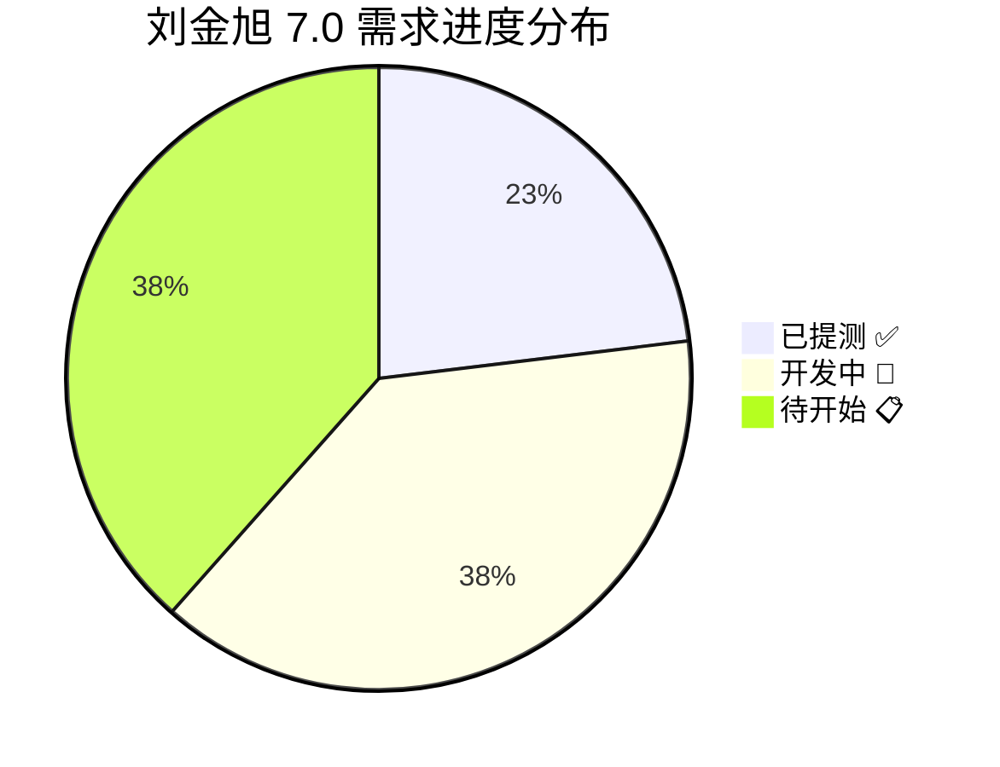
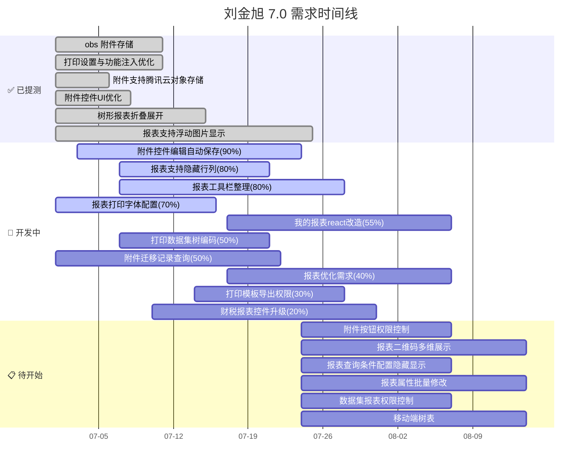
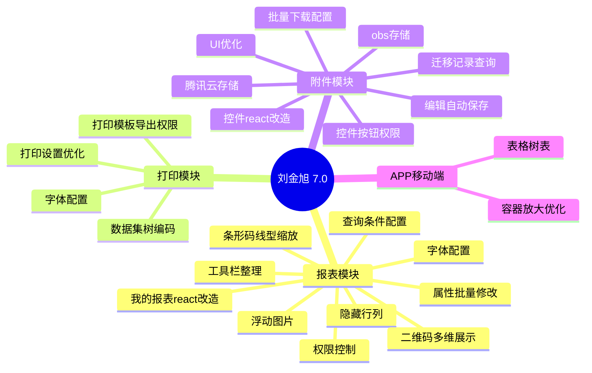

# 🚀 7.0 需求项目规划 — 刘金旭（苏星河）

## 📋 概览

| 维度 | 内容 |
|------|------|
| **人员** | 刘金旭（苏星河） |
| **版本** | i8 7.0 |
| **所属部门** | 技术中心 PaaS 平台研发部 |
| **主要负责** | 报表模块 · 附件模块 · 打印模块 |
| **协作搭档** | 孟三涛（后端）、吴红桥（后端）、徐远鹏（产品） |

---

## 📊 进度总览

| 状态 | 数量 | 进度范围 |
|------|:----:|:--------:|
| ✅ 已提测 | **6** | 100% |
| 🔄 开发中 | **10** | 20% ~ 90% |
| 📋 待开始 | **10** | 0% |
| **合计** | **26** | — |

---

## ✅ 已提测（6项）

| 需求编号 | 需求描述 | 产品 | 阶段 | 预估工时(h) | 优先级 |
|:--------:|----------|:----:|:----:|:----------:|:------:|
| R-260602-000009 | obs 附件存储 | i8 | 一阶段 | 后端10 + 前端5 | — |
| R-260624-000009 | 打印设置与功能注入列表优化 | i8 | 一阶段 | 后端10 + 前端5 | P1 |
| R-260626-000003 | 附件支持腾讯云的对象存储 | 附件 | 一阶段 | 后端5 + 前端3 | P1 |
| R-260707-000002 | 附件控件 UI 优化 | i8 | 一阶段 | 前端5 | P1 |
| R-260702-000018 | 树形报表支持折叠、展开功能 | i8 | 一阶段 | 后端20 | P1 |
| R-260715-000015 | 报表支持浮动图片显示 | i8 | 一阶段 | 后端15 + 前端30 | P1 |

---

## 🔄 开发中（10项）

| 需求编号 | 需求描述 | 进度 | 产品 | 阶段 | 优先级 | 预计提测 |
|:--------:|----------|:---:|:----:|:----:|:------:|:--------:|
| R-260625-000004 | 附件控件编辑和自动保存逻辑修改 | **90%** | i8 | 一阶段 | P1 | 7月10日 |
| R-260702-000014 | 报表支持隐藏行/列 | **80%** | i8 | 一阶段 | P1 | — |
| R-260601-000013 | 报表的工具栏整理，参考 excel 分类 | **80%** | i8 | 二阶段 | P1 | — |
| R-260528-000001 | 报表/打印字体配置 | **70%** | i8 | 一阶段 | P1 | 7月10日 |
| R-260601-000016 | 我的报表功能 react 改造 | **55%** | i8 | 二阶段 | P2 | 7月29日 |
| R-260702-000011 | 打印数据集树字段展示增加编码 | **50%** | i8 | 一阶段 | P1 | — |
| R-260514-000016 | 附件迁移增加历史迁移记录查询 | **50%** | 附件 | 一阶段 | — | 8月10日 |
| R-260601-000015 | 报表优化需求（条形码、线型、缩放等） | **40%** | i8 | 二阶段 | P2 | 7月27日 |
| R-260601-000018 | 打印模板导出权限控制改造 | **30%** | i8 | 二阶段 | P1 | 7月14日 |
| R-260601-000014 | 财税报表控件升级支持 | **20%** | i8 | 一、二阶段 | P1 | 7月10日 |

---

## 📋 待开始（10项）

| 需求编号 | 需求描述 | 产品 | 阶段 | 预估工时(h) | 优先级 | 预计提测 |
|:--------:|----------|:----:|:----:|:----------:|:------:|:--------:|
| R-260701-000066 | 附件控件按钮权限控制 | i8 | 一阶段 | 后端20 + 前端10 | **P1** | 7月8日 |
| R-260612-000002 | 报表/打印二维码展示支持多个字段 | i8 | 一阶段 | 后端30 + 前端10 | **P1** | — |
| R-260702-000017 | 报表查询条件支持用户自行配置隐藏/显示 | i8 | 一阶段 | 后端15 + 前端10 | **P1** | — |
| R-260326-000012 | 报表设计支持通用属性的批量修改 | i8 | 二阶段 | 后端0 + 前端15 | **P2** | 7月17日 |
| R-260601-000017 | 数据集、报表权限控制 | i8 | 二阶段 | 后端5 + 前端0 | P2 | 7月13日 |
| APP | 移动端表格控件支持树表 | APP | 一阶段 | 后端0 + 前端15 | P2 | 8月3日 |
| R-250806-000001 | 报表展示字段支持注册为权限 | i8 | 二阶段 | 后端25 + 前端5 | P3 | — |
| APP | 技改需求-移动表格容器放大后使用效果优化 | APP | 一阶段 | 后端0 + 前端15 | P3 | — |
| R-260123-000013 | 附件批量下载文件名可自行配置 | 附件 | 一阶段 | 后端20 + 前端15 | — | 8月6日 |
| R-260514-000009 | 控件展示配置 react 改造 | 附件 | 一阶段 | 后端0 + 前端5 | P3 | — |

---

## 📅 甘特图

---

## 🔥 优先级排序（按紧急度）

### 第一优先级（P1 · 紧急）
1. **R-260701-000066** — 附件控件按钮权限控制（待开始，需置换）
2. **R-260625-000004** — 附件控件编辑和自动保存逻辑修改（**90%**，即将完成）
3. **R-260528-000001** — 报表/打印字体配置（**70%**，上海电气项目）
4. **R-260702-000014** — 报表支持隐藏行/列（**80%**，海螺水泥）
5. **R-260702-000011** — 打印数据集树字段展示增加编码（**50%**，海螺水泥）
6. **R-260601-000014** — 财税报表控件升级支持（**20%**）
7. **R-260612-000002** — 报表/打印二维码展示支持多个字段（待开始）
8. **R-260702-000017** — 报表查询条件配置隐藏/显示（待开始）

### 第二优先级（P2）
1. **R-260601-000016** — 我的报表功能 react 改造（**55%**）
2. **R-260601-000015** — 报表优化需求（**40%**）
3. **R-260601-000018** — 打印模板导出权限控制改造（**30%**）
4. **R-260326-000012** — 报表设计支持通用属性批量修改（待开始）
5. **R-260601-000017** — 数据集、报表权限控制（待开始）
6. **APP** — 移动端表格控件支持树表（待开始）

### 第三优先级（P3 / 未定级）
1. 剩余待开始任务

---

## 🧩 模块分布

---

## 📝 最新进展记录

### 2026-07-24
- 刘金旭在 7.0 版本中共有 **26** 项需求任务
- 已完成 **6** 项（已提测），开发中 **10** 项，待开始 **10** 项
- 整体完成进度约 **42%**（含开发中按进度折算）
- 主要协作伙伴：孟三涛（后端）、吴红桥（附件后端）、徐远鹏（产品）

---

## 👥 协作人员

| 角色 | 人员 |
|------|------|
| 产品负责人 | 徐远鹏(子仪)、李江斌(张顺)、侯玉珍(大玉儿) |
| 后端协作 | 孟三涛(清风)、吴红桥(景延广) |
| 前端协作 | 刘金旭(苏星河) |
| 测试 | — |
