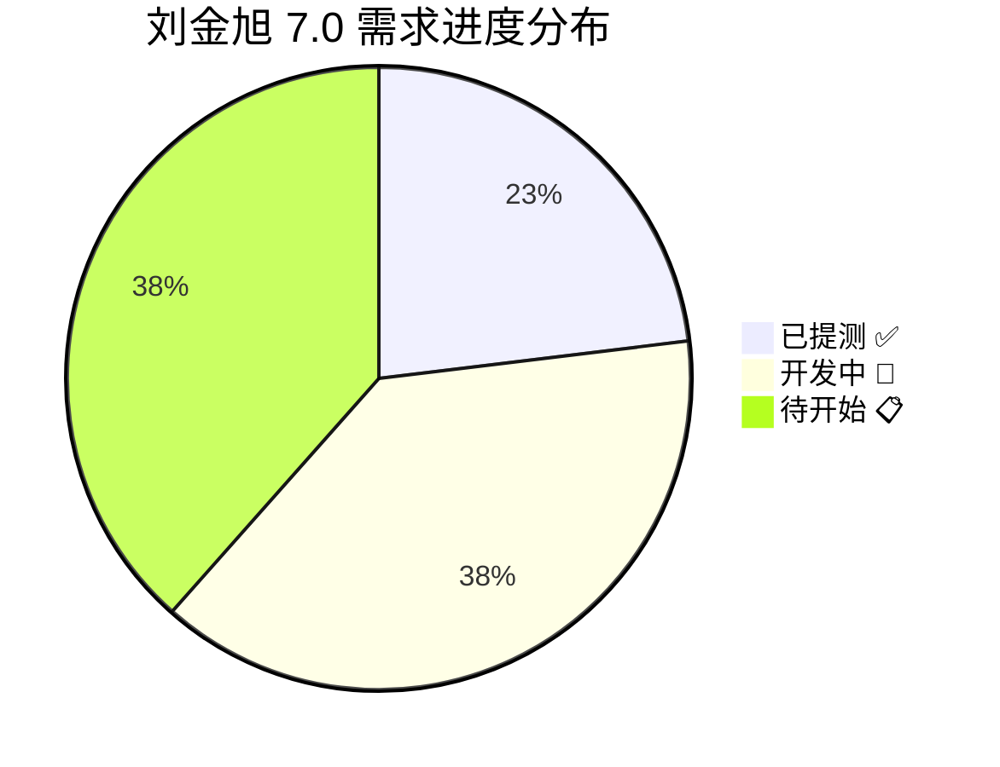
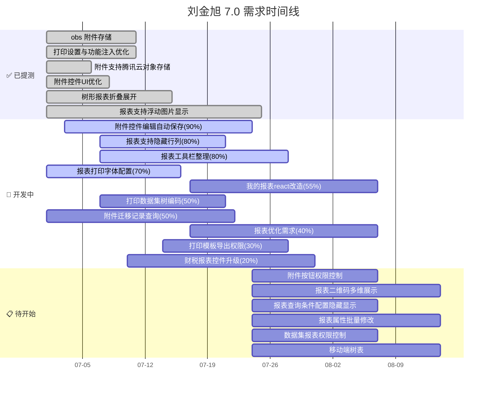
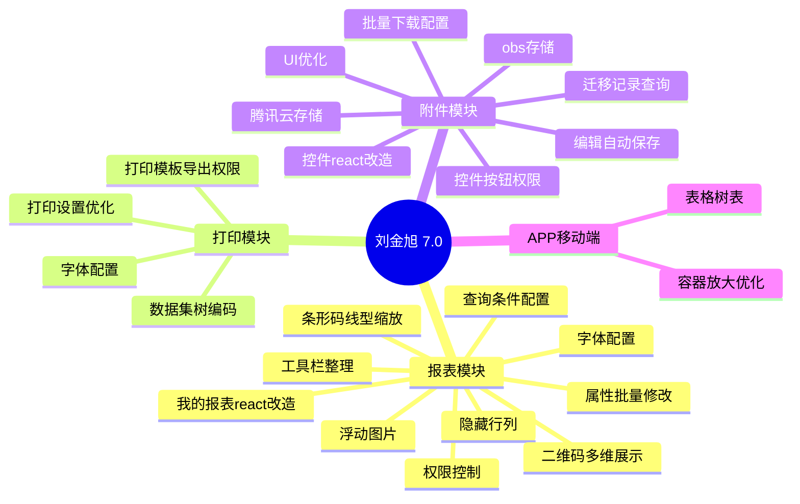

# 🚀 7.0 需求项目规划 — 刘金旭（苏星河）

## 📋 概览

| 维度          | 内容                                                       |
| ----------- | -------------------------------------------------------- |
| **人员**      | 刘金旭（苏星河）                                                 |
| **版本**      | i8 7.0                                                   |
| **所属部门**    | 技术中心 PaaS 平台研发部                                          |
| **主要负责**    | 报表模块 · 附件模块 · 打印模块                                       |
| **协作搭档**    | 孟三涛（后端）、吴红桥（后端）、徐远鹏（产品）                                  |
| **Wiki 系统** | [http://ngwiki.newgrand.com](http://ngwiki.newgrand.com) |

---

## 📊 进度总览



| 状态 | 数量 | 进度范围 |
|------|:----:|:--------:|
| ✅ 已提测 | **6** | 100% |
| 🔄 开发中 | **10** | 20% ~ 90% |
| 📋 待开始 | **10** | 0% |
| **合计** | **26** | — |

---

## ✅ 已提测（6项）

| 需求编号 | 需求描述 | Wiki 文档 | 产品 | 阶段 | 优先级 |
|:--------:|----------|:---------:|:----:|:----:|:------:|
| R-260602-000009 | obs 附件存储 | [📄 Wiki](http://ngwiki.newgrand.com/mediawiki/index.php/Obs%E9%99%84%E4%BB%B6%E5%AD%98%E5%82%A8) | i8 | 一阶段 | — |
| R-260624-000009 | 打印设置与功能注入列表优化 | [📄 Wiki](http://ngwiki.newgrand.com/mediawiki/index.php/%E6%89%93%E5%8D%B0%E8%AE%BE%E7%BD%AE%E4%B8%8E%E5%8A%9F%E8%83%BD%E6%B3%A8%E5%85%A5%E5%88%97%E8%A1%A8%E4%BC%98%E5%8C%96) | i8 | 一阶段 | P1 |
| R-260626-000003 | 附件支持腾讯云的对象存储 | [📄 Wiki](http://ngwiki.newgrand.com/mediawiki/index.php/%E9%99%84%E4%BB%B6%E6%94%AF%E6%8C%81%E8%85%BE%E8%AE%AF%E4%BA%91%E7%9A%84%E5%AF%B9%E8%B1%A1%E5%AD%98%E5%82%A8) | 附件 | 一阶段 | P1 |
| R-260707-000002 | 附件控件 UI 优化 | [📄 Wiki](http://ngwiki.newgrand.com/mediawiki/index.php/%E9%99%84%E4%BB%B6%E6%8E%A7%E4%BB%B6UI%E6%94%B9%E9%80%A0) | i8 | 一阶段 | P1 |
| R-260702-000018 | 树形报表支持折叠、展开功能 | [📄 Wiki](http://ngwiki.newgrand.com/mediawiki/index.php/%E6%A0%91%E5%BD%A2%E6%8A%A5%E8%A1%A8%E6%94%AF%E6%8C%81%E6%8A%98%E5%8F%A0%E3%80%81%E5%B1%95%E5%BC%80%E5%8A%9F%E8%83%BD) | i8 | 一阶段 | P1 |
| R-260715-000015 | 报表支持浮动图片显示 | [📄 Wiki](http://ngwiki.newgrand.com/mediawiki/index.php/%E6%8A%A5%E8%A1%A8%E6%94%AF%E6%8C%81%E6%B5%AE%E5%8A%A8%E5%9B%BE%E7%89%87%E6%98%BE%E7%A4%BA) | i8 | 一阶段 | P1 |

---

## 🔄 开发中（10项）

| 需求编号 | 需求描述 | 进度 | Wiki 文档 | 产品 | 阶段 | 优先级 | 预计提测 |
|:--------:|----------|:---:|:---------:|:----:|:----:|:------:|:--------:|
| R-260625-000004 | 附件控件编辑和自动保存逻辑修改 | **90%** | [📄 Wiki](http://ngwiki.newgrand.com/mediawiki/index.php/%E9%99%84%E4%BB%B6%E6%8E%A7%E4%BB%B6%E7%BC%96%E8%BE%91%E5%92%8C%E8%87%AA%E5%8A%A8%E4%BF%9D%E5%AD%98%E9%80%BB%E8%BE%91%E4%BF%AE%E6%94%B9) | i8 | 一阶段 | P1 | 7月10日 |
| R-260702-000014 | 报表支持隐藏行/列 | **80%** | [📄 Wiki](http://ngwiki.newgrand.com/mediawiki/index.php/%E6%8A%A5%E8%A1%A8%E8%AE%BE%E8%AE%A1%E5%99%A8%E8%A1%8C/%E5%88%97%E9%9A%90%E8%97%8F) | i8 | 一阶段 | P1 | — |
| R-260601-000013 | 报表的工具栏整理，参考 excel 分类 | **80%** | [📄 Wiki](http://ngwiki.newgrand.com/mediawiki/index.php/%E6%8A%A5%E8%A1%A8%E4%BC%98%E5%8C%96%E9%9C%80%E6%B1%822604) | i8 | 二阶段 | P1 | — |
| R-260528-000001 | 报表/打印字体配置 | **70%** | [📄 Wiki](http://ngwiki.newgrand.com/mediawiki/index.php/%E6%8A%A5%E8%A1%A8/%E6%89%93%E5%8D%B0%E5%AD%97%E4%BD%93%E9%85%8D%E7%BD%AE) | i8 | 一阶段 | P1 | 7月10日 |
| R-260601-000016 | 我的报表功能 react 改造 | **55%** | [📄 企微文档](https://doc.weixin.qq.com/doc/w3_AdIA2gZOANcCNxgd0JlS0SlilzNca?scode=ALQADQeZAAkWqXhOyI) | i8 | 二阶段 | P2 | 7月29日 |
| R-260702-000011 | 打印数据集树字段展示增加编码 | **50%** | [📄 Wiki](http://ngwiki.newgrand.com/mediawiki/index.php/%E6%8A%A5%E8%A1%A8%5C%E6%89%93%E5%8D%B0%E6%95%B0%E6%8D%AE%E9%9B%86%E6%A0%91%E5%AD%97%E6%AE%B5%E5%B1%95%E7%A4%BA%E5%A2%9E%E5%8A%A0%E7%BC%96%E7%A0%81) | i8 | 一阶段 | P1 | — |
| R-260514-000016 | 附件迁移增加历史迁移记录查询 | **50%** | [📄 Wiki](http://ngwiki.newgrand.com/mediawiki/index.php/%E9%99%84%E4%BB%B6%E8%BF%81%E7%A7%BB%E5%A2%9E%E5%8A%A0%E5%8E%86%E5%8F%B2%E8%BF%81%E7%A7%BB%E8%AE%B0%E5%BD%95%E6%9F%A5%E8%AF%A2) | 附件 | 一阶段 | — | 8月10日 |
| R-260601-000015 | [[R-260601-000015-报表优化需求与开发计划|报表优化需求（条形码、线型、缩放等）]] | **40%** | [📄 Wiki](http://ngwiki.newgrand.com/mediawiki/index.php/%E6%8A%A5%E8%A1%A8%E4%BC%98%E5%8C%96%E9%9C%80%E6%B1%822604) | i8 | 二阶段 | P2 | 7月27日 |
| R-260601-000018 | 打印模板导出权限控制改造 | **30%** | [📄 Wiki](http://ngwiki.newgrand.com/mediawiki/index.php/%E6%8A%A5%E8%A1%A8%E4%BC%98%E5%8C%96%E9%9C%80%E6%B1%822604) | i8 | 二阶段 | P1 | 7月14日 |
| R-260601-000014 | 财税报表控件升级支持 | **20%** | ⚠️ 无链接 | i8 | 一、二阶段 | P1 | 7月10日 |

---

## 📋 待开始（10项）

| 需求编号 | 需求描述 | Wiki 文档 | 产品 | 阶段 | 优先级 | 预计提测 |
|:--------:|----------|:---------:|:----:|:----:|:------:|:--------:|
| R-260701-000066 | 附件控件按钮权限控制 | [📄 Wiki](http://ngwiki.newgrand.com/mediawiki/index.php/%E9%99%84%E4%BB%B6%E6%8E%A7%E4%BB%B6%E6%8C%89%E9%92%AE%E6%9D%83%E9%99%90%E6%8E%A7%E5%88%B6) | i8 | 一阶段 | **P1** | 7月8日 |
| R-260612-000002 | 报表/打印二维码展示支持多个字段 | [📄 Wiki](http://ngwiki.newgrand.com/mediawiki/index.php/%E6%8A%A5%E8%A1%A8/%E6%89%93%E5%8D%B0%E4%BA%8C%E7%BB%B4%E7%A0%81%E5%B1%95%E7%A4%BA%E6%94%AF%E6%8C%81%E5%A4%9A%E4%B8%AA%E5%AD%97%E6%AE%B5) | i8 | 一阶段 | **P1** | — |
| R-260702-000017 | 报表查询条件支持用户自行配置隐藏/显示 | [📄 Wiki](http://ngwiki.newgrand.com/mediawiki/index.php/%E6%8A%A5%E8%A1%A8%E6%9F%A5%E8%AF%A2%E6%9D%A1%E4%BB%B6%E6%94%AF%E6%8C%81%E7%94%A8%E6%88%B7%E8%87%AA%E8%A1%8C%E9%85%8D%E7%BD%AE%E9%9A%90%E8%97%8F/%E6%98%BE%E7%A4%BA) | i8 | 一阶段 | **P1** | — |
| R-260326-000012 | 报表设计支持通用属性的批量修改 | [📄 Wiki](http://ngwiki.newgrand.com/mediawiki/index.php/%E6%8A%A5%E8%A1%A8%E4%BC%98%E5%8C%96%E9%9C%80%E6%B1%822604) | i8 | 二阶段 | **P2** | 7月17日 |
| R-260601-000017 | 数据集、报表权限控制 | [📄 Wiki](http://ngwiki.newgrand.com/mediawiki/index.php/%E6%8A%A5%E8%A1%A8%E4%BC%98%E5%8C%96%E9%9C%80%E6%B1%822604) | i8 | 二阶段 | P2 | 7月13日 |
| APP | 移动端表格控件支持树表 | ⚠️ 无链接 | APP | 一阶段 | P2 | 8月3日 |
| R-250806-000001 | 报表展示字段支持注册为权限 | [📄 Wiki](http://ngwiki.newgrand.com/mediawiki/index.php/%E6%8A%A5%E8%A1%A8%E4%BC%98%E5%8C%96%E9%9C%80%E6%B1%822604) | i8 | 二阶段 | P3 | — |
| APP | 技改需求-移动表格容器放大后使用效果优化 | ⚠️ 无链接 | APP | 一阶段 | P3 | — |
| R-260123-000013 | 附件批量下载文件名可自行配置 | [📄 Wiki](http://ngwiki.newgrand.com/mediawiki/index.php/%E9%99%84%E4%BB%B6%E6%89%B9%E9%87%8F%E4%B8%8B%E8%BD%BD%E6%96%87%E4%BB%B6%E5%90%8D%E5%8F%AF%E8%87%AA%E8%A1%8C%E9%85%8D%E7%BD%AE) | 附件 | 一阶段 | — | 8月6日 |
| R-260514-000009 | 控件展示配置 react 改造 | [📄 Wiki](http://ngwiki.newgrand.com/mediawiki/index.php/%E6%8E%A7%E4%BB%B6%E5%B1%95%E7%A4%BA%E9%85%8D%E7%BD%AEreact%E6%94%B9%E9%80%A0) | 附件 | 一阶段 | P3 | — |

---

## 🔧 后端实现详情

以下是从 `需求-7.0.docx` 中提取的、与刘金旭任务相关的后端实现细节：

---

### 1. R-260715-000015 报表支持浮动图片显示 ✅ 已提测

**接口：** `reportcenter/reportDesign/saveReportDesign` (POST)

**请求参数中 schema 增加 `floatImages`：**

```json
{
  "reportId": "6500000000000009",
  "dataSetIds": ["6500000000000018"],
  "schema": "..."
}
```

**floatImages 结构：**

| 字段 | 类型 | 说明 |
|:----|:----|:----|
| `anchorCell` | string | 锚点单元格（如 "A1"） |
| `anchorRow` | int | 锚点行 |
| `anchorCol` | int | 锚点列 |
| `sourceType` | string | 来源类型：`image`（图片）或 `field`（数据集字段） |
| `offsetY` | int | Y 偏移 |
| `offsetX` | int | X 偏移 |
| `width` | int | 宽度 |
| `height` | int | 高度 |
| `zIndex` | int | 图层顺序 |
| `imageData` | object | 图片数据 |

**imageData 结构：**

| 字段 | 说明 |
|:----|:----|
| `imageShowType` | `0`-不缩放 `1`-自动缩放不保持比例 `2`-自动缩放保持比例 |
| `value` | 图片 asrFid（sourceType=image时） |
| `dataSetId` | 数据集ID（sourceType=field时） |
| `fieldId` | 字段ID（sourceType=field时） |
| `imageSource` | 图片来源（如 `attachment_id`） |

**预览接口：** `reportcenter/reportDesign/previewReportData`

预览返回中的 `floatImages` 包含 `asrFid` 和 `formatData`（图片地址）。

---

### 2. [[R-260601-000015-报表优化需求与开发计划|R-260601-000015 报表优化需求（条形码、线型、打印自动缩放等）]] 🔄 开发中 40%

#### 条形码

Cell 属性中 `otherShowType` 增加 `bar_code`（条形码），新增 `encodeType`：

```json
{
  "cellData": {
    "otherShowType": "bar_code",  // qr_code=二维码, bar_code=条形码
    "encodeType": "code_128"      // code_128, code_39, ean_13
  }
}
```

| 编码类型 | 说明 |
|:---------|:----|
| `code_128` | 通用条形码（最常用） |
| `code_39` | 可变长度条形码 |
| `ean_13` | 商品条形码标准 |

#### 线型（borderStyle）

新增 `cellBorders` 属性：

```json
{
  "cellBorders": {
    "top": {
      "width": 1,
      "color": "#FE0200",
      "borderStyle": "2",
      "hide": false
    }
  }
}
```

**borderStyle 枚举值：**

| 值 | 名称 | 说明 |
|:--:|:----|:----|
| 0 | NONE | 无边框 |
| 1 | THIN | 细实线（默认） |
| 2 | MEDIUM | 中等实线（表头分隔） |
| 3 | DASHED | 长虚线 |
| 4 | DOTTED | 点状虚线 |
| 5 | THICK | 粗实线（标题/合计行） |
| 6 | DOUBLE | 双实线 |
| 7 | HAIR | 极细发丝线 |
| 8 | MEDIUM_DASHED | 中等虚线 |
| 9 | DASH_DOT | 点划线 |
| 10 | MEDIUM_DASH_DOT | 中等点划线 |
| 11 | DASH_DOT_DOT | 双点划线 |
| 12 | MEDIUM_DASH_DOT_DOT | 中等双点划线 |
| 13 | SLANTED_DASH_DOT | 斜向点划线 |

---

### 3. R-260702-000014 报表支持隐藏行/列 🔄 开发中 80%

Cell 属性中新增行列隐藏字段：

```json
{
  "rowHidden": false,   // true=行隐藏
  "colHidden": false,   // true=列隐藏
  "cellName": "A1"
}
```

| 字段 | 类型 | 说明 |
|:----|:----:|:----|
| `rowHidden` | boolean | 当前行是否隐藏 |
| `colHidden` | boolean | 当前列是否隐藏 |

---

### 4. R-260624-000009 打印设置与功能注入列表优化 ✅ 已提测

**接口：** `reportcenter/printManage/pagePrint` (POST)

**请求参数：**

```json
{
  "pageIndex": 1,
  "pageSize": 10,
  "keyword": "",
  "status": "",
  "busPhId": 16746  // 业务类型编码，空则查所有
}
```

**返回结果关键字段：**

| 字段 | 说明 |
|:----|:----|
| `billNo` | 单据编号 |
| `busCode` | 业务类型编码 |
| `busName` | 业务类型名称 |
| `name` | 打印模板名称 |
| `status` | 状态（1-启用） |
| `templateType` | 模板类型 |
| `useScopeType` | 使用范围 |

---

## 📅 甘特图



---

## 🔥 优先级排序（按紧急度）

### 第一优先级（P1 · 紧急）
1. **R-260701-000066** — 附件控件按钮权限控制（待开始，需置换） → [📄 Wiki](http://ngwiki.newgrand.com/mediawiki/index.php/%E9%99%84%E4%BB%B6%E6%8E%A7%E4%BB%B6%E6%8C%89%E9%92%AE%E6%9D%83%E9%99%90%E6%8E%A7%E5%88%B6)
2. **R-260625-000004** — 附件控件编辑和自动保存逻辑修改（**90%**） → [📄 Wiki](http://ngwiki.newgrand.com/mediawiki/index.php/%E9%99%84%E4%BB%B6%E6%8E%A7%E4%BB%B6%E7%BC%96%E8%BE%91%E5%92%8C%E8%87%AA%E5%8A%A8%E4%BF%9D%E5%AD%98%E9%80%BB%E8%BE%91%E4%BF%AE%E6%94%B9)
3. **R-260528-000001** — 报表/打印字体配置（**70%**，上海电气） → [📄 Wiki](http://ngwiki.newgrand.com/mediawiki/index.php/%E6%8A%A5%E8%A1%A8/%E6%89%93%E5%8D%B0%E5%AD%97%E4%BD%93%E9%85%8D%E7%BD%AE)
4. **R-260702-000014** — 报表支持隐藏行/列（**80%**，海螺水泥） → [📄 Wiki](http://ngwiki.newgrand.com/mediawiki/index.php/%E6%8A%A5%E8%A1%A8%E8%AE%BE%E8%AE%A1%E5%99%A8%E8%A1%8C/%E5%88%97%E9%9A%90%E8%97%8F)
5. **R-260702-000011** — 打印数据集树字段展示增加编码（**50%**，海螺水泥） → [📄 Wiki](http://ngwiki.newgrand.com/mediawiki/index.php/%E6%8A%A5%E8%A1%A8%5C%E6%89%93%E5%8D%B0%E6%95%B0%E6%8D%AE%E9%9B%86%E6%A0%91%E5%AD%97%E6%AE%B5%E5%B1%95%E7%A4%BA%E5%A2%9E%E5%8A%A0%E7%BC%96%E7%A0%81)
6. **R-260601-000014** — 财税报表控件升级支持（**20%**）→ ⚠️ 无 Wiki 链接
7. **R-260612-000002** — 报表/打印二维码展示支持多个字段（待开始） → [📄 Wiki](http://ngwiki.newgrand.com/mediawiki/index.php/%E6%8A%A5%E8%A1%A8/%E6%89%93%E5%8D%B0%E4%BA%8C%E7%BB%B4%E7%A0%81%E5%B1%95%E7%A4%BA%E6%94%AF%E6%8C%81%E5%A4%9A%E4%B8%AA%E5%AD%97%E6%AE%B5)
8. **R-260702-000017** — 报表查询条件配置隐藏/显示（待开始） → [📄 Wiki](http://ngwiki.newgrand.com/mediawiki/index.php/%E6%8A%A5%E8%A1%A8%E6%9F%A5%E8%AF%A2%E6%9D%A1%E4%BB%B6%E6%94%AF%E6%8C%81%E7%94%A8%E6%88%B7%E8%87%AA%E8%A1%8C%E9%85%8D%E7%BD%AE%E9%9A%90%E8%97%8F/%E6%98%BE%E7%A4%BA)

### 第二优先级（P2）
1. **R-260601-000016** — 我的报表功能 react 改造（**55%**）→ [📄 企微文档](https://doc.weixin.qq.com/doc/w3_AdIA2gZOANcCNxgd0JlS0SlilzNca?scode=ALQADQeZAAkWqXhOyI)
2. **R-260601-000015** — [[R-260601-000015-报表优化需求与开发计划|报表优化需求与开发计划]]（**40%**）→ [📄 Wiki](http://ngwiki.newgrand.com/mediawiki/index.php/%E6%8A%A5%E8%A1%A8%E4%BC%98%E5%8C%96%E9%9C%80%E6%B1%822604)
3. **R-260601-000018** — 打印模板导出权限控制改造（**30%**）→ [📄 Wiki](http://ngwiki.newgrand.com/mediawiki/index.php/%E6%8A%A5%E8%A1%A8%E4%BC%98%E5%8C%96%E9%9C%80%E6%B1%822604)
4. **R-260326-000012** — 报表设计支持通用属性批量修改（待开始）→ [📄 Wiki](http://ngwiki.newgrand.com/mediawiki/index.php/%E6%8A%A5%E8%A1%A8%E4%BC%98%E5%8C%96%E9%9C%80%E6%B1%822604)
5. **R-260601-000017** — 数据集、报表权限控制（待开始）→ [📄 Wiki](http://ngwiki.newgrand.com/mediawiki/index.php/%E6%8A%A5%E8%A1%A8%E4%BC%98%E5%8C%96%E9%9C%80%E6%B1%822604)
6. **APP** — 移动端表格控件支持树表（待开始）→ ⚠️ 无链接

### 第三优先级（P3 / 未定级）
1. 剩余待开始任务

---

## 🧩 模块分布



---

## 📝 最新进展记录

### 2026-07-24
- 刘金旭在 7.0 版本中共有 **26** 项需求任务
- 已完成 **6** 项（已提测），开发中 **10** 项，待开始 **10** 项
- 整体完成进度约 **42%**（含开发中按进度折算）
- 主要协作伙伴：孟三涛（后端）、吴红桥（附件后端）、徐远鹏（产品）
- Wiki 系统地址：http://ngwiki.newgrand.com

---

## 👥 协作人员

| 角色 | 人员 |
|------|------|
| 产品负责人 | 徐远鹏(子仪)、李江斌(张顺)、侯玉珍(大玉儿) |
| 后端协作 | 孟三涛(清风)、吴红桥(景延广) |
| 前端协作 | 刘金旭(苏星河) |
| 测试 | — |
