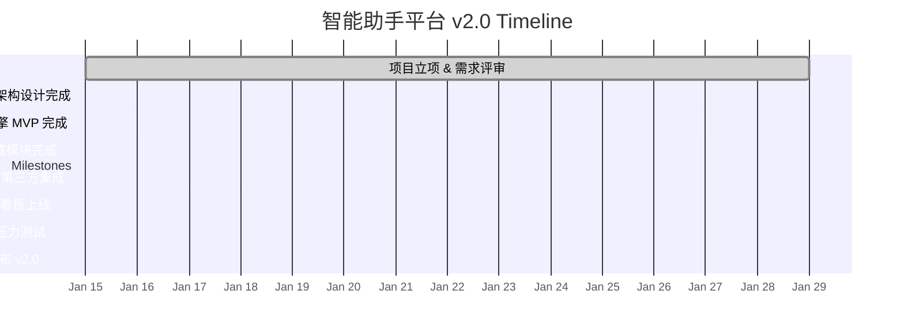

# 🚀 智能助手平台 v2.0

## 📋 Overview

_Created: 2026-07-24_

## 🎯 Goals

1. 构建一个基于 LLM 的智能客服助手平台，支持多轮对话与知识库集成
2. 实现对话历史记录与分析看板，帮助运营团队优化服务
3. 提供可插拔的插件系统，支持第三方工具集成
4. 保证 99.9% 的服务可用性，响应时间 < 500ms

## 👥 Team

- 张三 - 项目经理
- 李四 - 后端架构师
- 王五 - NLP 工程师
- 赵六 - 前端工程师
- 陈七 - QA 测试

## 📅 Milestones



| Milestone | Date | Status |
|-----------|------|--------|
| 项目立项 & 需求评审 | 2026-01-15 | ✅ Done |
| 技术选型 & 架构设计完成 | 2026-02-01 | ✅ Done |
| 核心对话引擎 MVP 完成 | 2026-03-15 | 🔄 Active |
| 知识库集成模块完成 | 2026-04-15 | 📋 Planned |
| 插件系统 & 第三方集成 | 2026-05-15 | 📋 Planned |
| 数据分析看板上线 | 2026-06-01 | 📋 Planned |
| 内测 & 压力测试 | 2026-06-20 | 📋 Planned |
| 正式发布 v2.0 | 2026-07-01 | 📋 Planned |

## ✅ Tasks

```dataview
TASK
FROM "projects"
WHERE contains(tags, "#project/v2-0")
```

## 📝 Notes

```dataview
LIST
FROM "projects/智能助手平台 v2.0"
SORT file.name ASC
```

## 🤝 Meetings

| Date | Topic | Attendees | Notes |
|------|-------|-----------|-------|
|      |       |           |       |

## 🔗 Related Notes

- [[plan/示例项目计划/Kanban|Kanban Board]]
- Daily notes tagged #project/v2-0
